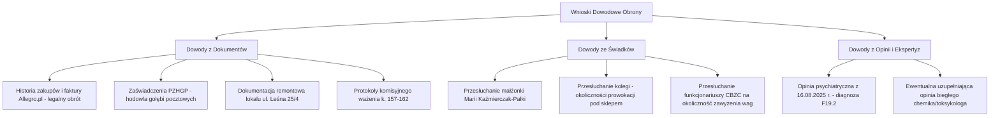

# Kompleksowa Analiza Prawno-Karna i Procesowa Sprawy

**Sygnatura akt śledztwa:** 4327-0.Ds.517.2025 (Prokuratura Rejonowa w Lubaniu)  
**Sąd właściwy:** Sąd Rejonowy w Lubaniu, II Wydział Karny  
**Oskarżony:** Marcin Pałka  
**Zarzuty z Aktu Oskarżenia (30.06.2026 r.):** art. 62 ust. 1, art. 54 ust. 1, art. 61 ustawy o przeciwdziałaniu narkomanii w zw. z art. 11 § 2 k.k. w zw. z art. 64 § 1 k.k.

---

## 📑 SPIS TREŚCI
1. [Stan Faktyczny a Manipulacje Organów Ścigania (CBZC Bydgoszcz)](#1-stan-faktyczny-a-manipulacje-organów-ścigania-cbzc-bydgoszcz)
2. [Analiza Dogmatyczna i Prawno-Karna Poszczególnych Zarzutów](#2-analiza-dogmatyczna-i-prawno-karna-poszczególnych-zarzutów)
   - [Zarzut I: art. 62 ust. 1 u.p.n. vs art. 62a u.p.n. (Posiadanie na własny użytek)](#zarzut-i-art-62-ust-1-upn-vs-art-62a-upn-posiadanie-na-własny-użytek)
   - [Zarzut II: art. 54 ust. 1 u.p.n. (Przyrządy a legalny cel gospodarczy)](#zarzut-ii-art-54-ust-1-upn-przyrządy-a-legalny-cel-gospodarczy)
   - [Zarzut III: art. 61 u.p.n. (Prekursory a brak zamiaru bezpośredniego)](#zarzut-iii-art-61-upn-prekursory-a-brak-zamiaru-bezpośredniego)
   - [Kwestia Recydywy z art. 64 § 1 k.k.](#kwestia-recydywy-z-art-64--1-kk)
3. [Naruszenia Procedury Karnej przez Funkcjonariuszy CBZC (Art. 171 k.p.k. i Owoce Zatrutej Czynności)](#3-naruszenia-procedury-karnej-przez-funkcjonariuszy-cbzc-art-171-kpk-i-owoce-zatrutej-czynności)
4. [Kluczowe Dowody Obrony i Wnioski Dowodowe do Złożenia w Sądzie](#4-kluczowe-dowody-obrony-i-wnioski-dowodowe-do-złożenia-w-sądzie)
5. [Taktyka i Ścieżki Procesowe przed Sądem Rejonowym w Lubaniu](#5-taktyka-i-ścieżki-procesowe-przed-sądem-rejonowym-w-lubaniu)
6. [Wpływ Wyniku Sprawy Karnej na Postępowanie Administracyjne (Prawo Jazdy)](#6-wpływ-wyniku-sprawy-karnej-na-postępowanie-administracyjne-prawo-jazdy)

---

## 1. Stan Faktyczny a Manipulacje Organów Ścigania (CBZC Bydgoszcz)

### A. Rzeczywisty przebieg zdarzeń z 09.04.2025 r.
1. **Fikcyjny incydent drogowy i zasadzka pod sklepem (ul. Groblowa)**: Trzech nieumundurowanych funkcjonariuszy CBZC z Bydgoszczy zatrzymało kolegę oskarżonego pod sklepem przy **ul. Groblowej w Lubaniu** pod pretekstem rzekomego zarysowania ich pojazdu przez oskarżonego.
2. **Brutalne zatrzymanie pod sklepem na ul. Groblowej w obecności 5-letniego dziecka**: Po przyjeździe oskarżonego z żoną i małoletnim synem Miłoszem (5 lat) na ul. Groblową w celu polubownego spisania oświadczenia sprawcy kolizji, funkcjonariusze bez uprzedniego wylegitymowania się rzucili oskarżonego i kolegę na samochód, wykręcili ręce i skuli w kajdanki.
3. **Fałszowanie miejsca w protokole CBZC (poświadczenie nieprawdy)**: W protokole zatrzymania funkcjonariusze wpisali jako miejsce zatrzymania **ul. Leśna 24**, ukrywając fakt prowokacji i fizycznego zatrzymania pod sklepem przy **ul. Groblowej**, aby sztucznie powiązać zatrzymanie z remontowanym lokalem.
4. **Bezprawny nacisk i groźby wobec żony (naruszenie art. 171 § 1 k.p.k.)**: Żona oskarżonego została rozdzielona od płaczącego dziecka i zastraszona (groźby odebrania dziecka przez opiekę społeczną oraz utraty pracy w banku), co zmusiło ją pod presją psychiczną do wskazania adresu remontowanego lokalu przy ul. Leśnej 25/4.
5. **Lokalizacja 1 — Dom rodziców (ul. Stawowa 6)**: Oskarżony dobrowolnie oświadczył, że posiada w domu rodziców śladowe ilości na własny użytek: ok. 0,5 g białego proszku oraz susz zielony „na lufkę” (ok. 0,2 g). Przeszukanie lokalu potwierdziło wyłącznie tę ilość.
6. **Lokalizacja 2 — Obiekt remontowany (ul. Leśna 25/4)**: Na miejscu budowy funkcjonariusze ujawnili legalnie nabyte odczynniki chemiczne i rozpuszczalniki oraz 3 kolby i zlewki w zmywarce. Na obiekcie **nie było żadnych narkotyków, gotowego produktu ani działającej linii produkcyjnej**.

### B. Próba sfabrykowania „fabryki narkotyków” i zawyżenie wag o 1500%
- W postanowieniu o przedstawieniu zarzutów z 11.04.2025 r. funkcjonariusze i prokuratura przypisali oskarżonemu posiadanie **34,96 g metamfetaminy** oraz **7,59 g marihuany**.
- Obrona złożyła natychmiastowy wniosek o komisyjne otwarcie bezpiecznych kopert i ponowne zważenie dowodów rzeczowych przy udziale KPP w Lubaniu (k. 157–162 akt śledztwa).
- **Wynik ponownego ważenia**: Rzeczywista masa substancji wynosiła zaledwie **0,26 g marihuany**, **0,42 g metamfetaminy**, **0,09 g mieszaniny kokainy i metamfetaminy** oraz **1,38 g kokainy**.
- Rozbieżność ta zmusiła Prokuraturę Rejonową w Lubaniu do wydania postanowienia o zmianie zarzutów (19.06.2026 r.), co stanowi **niepodważalny dowód procesowy na manipulację i nierzetelność wstępnych ustaleń CBZC**.

---

## 2. Analiza Dogmatyczna i Prawno-Karna Poszczególnych Zarzutów

### Zarzut I: art. 62 ust. 1 u.p.n. vs art. 62a u.p.n. (Posiadanie na własny użytek)

#### Stan prawny:
- **Art. 62 ust. 1 u.p.n.**: Kto, wbrew przepisom ustawy, posiada środki odurzające lub substancje psychotropowe, podlega karze pozbawienia wolności do lat 3.
- **Art. 62a u.p.n. (klauzula umorzeniowa)**: *Jeżeli przedmiotem czynu, o którym mowa w art. 62 ust. 1 lub 3, są środki odurzające lub substancje psychotropowe w ilości nieznacznej, przeznaczone na własny użytek sprawcy, postępowanie można umorzyć również przed wydaniem postanowienia o wszczęciu śledztwa lub dochodzenia, jeżeli orzeczenie wobec sprawcy kary byłoby niecelowe ze względu na okoliczności popełnienia czynu, a także stopień jego społecznej szkodliwości.*

#### Analiza w realiach sprawy:
1. **Kryterium ilości nieznacznej**: W orzecznictwie SN (m.in. wyrok SN z 20.01.2016 r., III KK 429/15; postanowienie SN z 25.09.2014 r., III KK 233/14) przyjmuje się, że ilość nieznaczna to ilość odpowiadająca doraźnym, jednostkowym potrzebom sprawcy (od 1 do kilku porcji handlowych/konsumpcyjnych). Ilość 0,26 g ziela konopi (jedna porcja), 0,42 g metamfetaminy oraz 1,38 g kokainy bezwzględnie mieści się w granicach ilości nieznacznej.
2. **Przeznaczenie na własny użytek**:
   - Substancje znajdowały się w miejscu zamieszkania oskarżonego (ul. Stawowa 6),
   - Brak porcjowania, brak woreczków dilerkach przygotowanych do dystrybucji, brak wag w miejscu przechowywania suszu,
   - Opinia biegłych psychiatrów i psychologa z 16.08.2025 r. jednoznacznie stwierdza u oskarżonego **zespół uzależnienia mieszanego (F19.2 według ICD-10)**. Fakt uzależnienia stanowi bezpośredni dowód na to, że śladowa ilość służyła wyłącznie zaspokojeniu własnego głodu narkotykowego, a nie obrotowi.
3. **Niecelowość orzekania kary**: Wobec oskarżonego zdiagnozowano potrzebę terapii uzależnień (pkt 5 wniosków biegłych). Zgodnie z ratio legis art. 62a u.p.n., karanie osoby uzależnionej za posiadanie śladowej ilości na własne potrzeby jest sprzeczne z celami prewencji indywidualnej.

---

### Zarzut II: art. 54 ust. 1 u.p.n. (Przyrządy a legalny cel gospodarczy)

#### Stan prawny:
- **Art. 54 ust. 1 u.p.n.**: Kto wyrabia, posiada, przechowuje, zbywa lub nabywa przyrządy, jeżeli z okoliczności wynika, że służą one lub są przeznaczone do niedozwolonego wytwarzania, przetwarzania lub przerobu środków odurzających lub substancji psychotropowych, podlega grzywnie, karze ograniczenia wolności albo pozbawienia wolności do lat 2.

#### Dogmatyczna linia obrony:
1. **Wymóg zamiaru bezpośredniego kierunkowego (dolus directus coloratus)**:
   - Przestępstwo to można popełnić **wyłącznie z zamiarem bezpośrednim o szczególnym zabarwieniu** — sprawca musi chcieć posiadać przyrządy *w celu* wytwarzania narkotyków lub mieć świadomość ich jednoznacznego przeznaczenia do tego procederu.
   - **Uchwała Sądu Najwyższego z dnia 10.05.2017 r. (IV KK 437/16)** oraz **Uchwała SN (I KZP 24/01)**: Samo posiadanie naczyń laboratoryjnych (kolb, zlewek, chłodnic) będących przedmiotami powszechnego użytku edukacyjnego, chemicznego czy przemysłowego **nie wypełnia znamion art. 54 ust. 1 u.p.n.**, jeżeli przedmioty te nie zostały specjalnie skonstruowane, przerobione ani zestawione w działającą linię produkcyjną dedykowaną do syntezy konkretnego środka.
2. **Faktyczne przeznaczenie sprzętu**:
   - Trzy kolby i zlewki znalezione w zmywarce w lokalu przy ul. Leśnej 25/4 nie stanowiły aparatury produkcyjnej.
   - Zakupione zostały legalnie na platformie Allegro.pl i służyły do sporządzania roztworów czyszczących, rozcieńczania preparatów do pielęgnacji i odkażania gołębników w prowadzonej przez oskarżonego hodowli gołębi pocztowych oraz prac malarsko-remontowych.

---

### Zarzut III: art. 61 u.p.n. (Prekursory a brak zamiaru bezpośredniego)

#### Stan prawny:
- **Art. 61 u.p.n.**: Kto, wbrew przepisom ustawy lub rozporządzenia (WE) nr 273/2004, w celu niedozwolonego wytworzenia środka odurzającego lub substancji psychotropowej, posiada lub wprowadza do obrotu prekursory, podlega karze pozbawienia wolności do lat 5.

#### Dogmatyczna linia obrony:
1. **Brak zamiaru wytworzenia (brak strony podmiotowej)**:
   - Znamieniem kwalifikującym art. 61 u.p.n. jest działanie **„w celu niedozwolonego wytworzenia”**. Sam fakt posiadania substancji chemicznej (nawet sklasyfikowanej jako prekursor kategorii 1, 2 lub 3, np. aceton, toluen, kwas siarkowy) jest relewantny prawnokarnie **tylko wtedy, gdy prokuratura udowodni zamiar wytworzenia narkotyków**.
   - Substancje ujawnione przy ul. Leśnej 25/4 to powszechnie stosowane w budownictwie rozpuszczalniki (aceton, toluen do usuwania starych powłok malarskich, odtłuszczania powierzchni przed malowaniem, czyszczenia narzędzi) oraz odczynniki wykorzystywane w hodowli gołębi (siarczan miedzi do zwalczania pasożytów i grzybic, kwas octowy do zakwaszania wody pitnej ptaków).
   - Wszystkie te substancje zostały nabyte legalnie na Allegro.pl z oficjalnych kont handlowych bez naruszenia ograniczeń obrotu.
2. **Brak zabezpieczenia gotowego produktu w lokalu Leśna 25/4**:
   - W lokalu nie ujawniono ani jednego grama wytworzonego narkotyku, co jednoznacznie przeczy tezie o prowadzeniu tam działalności produkcyjnej.

---

### Kwestia Recydywy z art. 64 § 1 k.k.

- **Podstawa zarzutu prokuratora**: Wyrok Sądu Rejonowego dla Wrocławia – Krzyków z dnia 07.03.2022 r. (sygn. akt VII K 1140/21) — skazanie za art. 56 ust. 1 u.p.n. (5 miesięcy pozbawienia wolności) oraz art. 62 ust. 1 u.p.n. (1 miesiąc), kara łączna: 6 miesięcy pozbawienia wolności odbyta do 10.12.2022 r.
- **Konsekwencje procesowe dla obrony**:
  1. Przy uniewinnieniu od zarzutów z art. 54 ust. 1 i art. 61 u.p.n., zarzut recydywy odnosi się wyłącznie do art. 62 ust. 1 u.p.n.
  2. Zgodnie z utrwalonym stanowiskiem doktryny i SN, uprzednia karalność (nawet w warunkach art. 64 § 1 k.k.) **nie stanowi formalnej przeszkody do zastosowania art. 62a u.p.n.**, jeżeli ilość środka jest nieznaczna, a sprawca jest uzależniony i wymaga leczenia.

---

## 3. Naruszenia Procedury Karnej przez Funkcjonariuszy CBZC (Art. 171 k.p.k. i Owoce Zatrutej Czynności)

W toku postępowania doszło do rażących uchybień przepisów Kodeksu postępowania karnego:

1. **Bezwzględny zakaz dowodowy z art. 171 § 1, § 5 pkt 1 i § 7 k.p.k.**:
   - Zmuszenie żony oskarżonego do wskazania adresu ul. Leśna 25/4 nastąpiło pod wpływem **groźby bezprawnej** (odebranie 5-letniego dziecka, utrata pracy w banku).
   - Zgodnie z art. 171 § 7 k.p.k., wyjaśnienia, oświadczenia i dowody uzyskane w warunkach wyłączających swobodę wypowiedzi lub za pomocą groźby bezprawnej **nie mogą stanowić dowodu w procesie karnym**.
2. **Naruszenie zasad zatrzymania i przeszukania (art. 220 § 3, art. 227 k.p.k.)**:
   - Brak okazania legitymacji służbowych w sposób umożliwiający ich odczytanie,
   - Przeszukanie bez uprzedniego nakazu prokuratorskiego w sytuacji, gdy funkcjonariusze mieli czas na jego uzyskanie,
   - Użycie środków przymusu bezpośredniego w sposób nieproporcjonalny i naruszający godność w obecności małoletniego dziecka.
3. **Naruszenie art. 2 § 2 i art. 4 k.p.k. (zasada prawdy materialnej i obiektywizmu)**:
   - Sfabrykowanie w protokole wstępnym wagi substancji (34,96 g zamiast 0,42 g / 1,80 g), co miało na celu sztuczne uzasadnienie zastosowania środków zapobiegawczych i wykreowanie pozorów przestępczości zorganizowanej.

---

## 4. Kluczowe Dowody Obrony i Wnioski Dowodowe do Złożenia w Sądzie

W odpowiedzi na akt oskarżenia należy złożyć formalne wnioski dowodowe:

### Wykaz wniosków dowodowych:
1. **Historia konta Allegro.pl i wyciągi bankowe**: na okoliczność legalnego zakupu odczynników chemicznych, rozpuszczalników i szkieł laboratoryjnych w celach gospodarczo-remontowych i hodowlanych.
2. **Zaświadczenie z Polskiego Związku Hodowców Gołębi Pocztowych (PZHGP)**: na okoliczność prowadzenia zarejestrowanej hodowli gołębi pocztowych oraz konieczności stosowania środków dezynfekcyjnych i przeciwgrzybiczych (siarczan miedzi, kwas octowy).
3. **Protokoły ponownego komisyjnego ważenia (k. 157–162 akt śledztwa)**: na okoliczność rzeczywistej, śladowej ilości substancji (0,26 g ziela konopi i drobne ilości metamfetaminy) oraz obalenia pierwotnych zarzutów CBZC.
4. **Zeznania świadka Marii Kaźmierczak-Pałki**: na okoliczność przebiegu zatrzymania, stosowania gróźb bezprawnych przez funkcjonariuszy CBZC, braku narkotyków w remontowanym lokalu przy ul. Leśnej oraz dobrowolnego wydania śladowych ilości z domu rodziców.
5. **Zeznania kolegi (świadka zatrzymania pod sklepem)**: na okoliczność sfingowanej kolizji drogowej jako pretekstu do zatrzymania.
6. **Opinia sądowo-psychiatryczno-psychologiczna z 16.08.2025 r.**: na okoliczność stwierdzonego zespołu uzależnienia (F19.2), pełnej poczytalności oraz celowości zastosowania leczenia odwykowego zamiast kary izolacyjnej.

---

## 5. Taktyka i Ścieżki Procesowe przed Sądem Rejonowym w Lubaniu

### Ścieżka A (Główna — Walka o Uniewinnienie i Umorzenie):
1. **Odpowiedź na Akt Oskarżenia**:
   - Złożenie pisma procesowego przed wyznaczeniem terminu rozprawy głównej.
   - Wniosek o skierowanie sprawy na **posiedzenie w trybie art. 339 § 3 pkt 1 lub 2 k.p.k.** i:
     - **Umorzenie postępowania na podstawie art. 62a u.p.n.** w zakresie zarzutu z art. 62 ust. 1 u.p.n. (posiadanie ilości nieznacznej na własny użytek),
     - **Umorzenie postępowania na podstawie art. 17 § 1 pkt 2 k.p.k.** wobec braku znamion czynu zabronionego co do art. 54 ust. 1 i art. 61 u.p.n. (brak zamiaru bezpośredniego produkcji, legalne przeznaczenie odczynników).
2. **Przebieg Rozprawy Głównej (jeśli sprawa trafi na rozprawę)**:
   - Składanie konsekwentnych wyjaśnień: odczynniki to materiały do remontu i gołębi z Allegro, narkotyki to wyłącznie śladowa ilość na własne potrzeby osoby uzależnionej.
   - Konfrontacja funkcjonariuszy CBZC z protokołami komisyjnego ważenia (k. 157–162) i wykazanie ich stronniczości oraz manipulacji.
   - **Cel końcowy**: Wyrok uniewinniający z art. 54 i 61 u.p.n. oraz umorzenie z art. 62a u.p.n. (lub ewentualnie symboliczna kara wolnościowa/grzywna z art. 62 ust. 3 u.p.n. jako wypadek mniejszej wagi).

---

## 6. Wpływ Wyniku Sprawy Karnej na Postępowanie Administracyjne (Prawo Jazdy)

Sprawa karna ma bezpośrednie przełożenie na toczące się postępowania administracyjne przed Starostą Lubańskim, SKO w Jeleniej Górze i WSA we Wrocławiu:

1. **Wniosek Prokuratora z 04.03.2026 r. (`4327-0.Pa.5.2026`)**:
   - Prokurator Magdalena Wesołowska skierowała wniosek do Starosty wyłącznie na podstawie rozpoznania F19.2 w opinii biegłych z 16.08.2025 r.
2. **Kluczowy dowód adresowy w aktach karnych**:
   - Protokół zatrzymania CBZC z 09.04.2025 r. oraz Postanowienie Prokuratora z 11.04.2025 r. zawierają **prawidłowy adres zamieszkania: ul. Stawowa 6 w Lubaniu**.
   - Fakt ten całkowicie kompromituje twierdzenia Starosty Lubańskiego, który uporczywie wysyłał decyzje na błędny adres (*ul. Stawowa 5*) i powoływał się na fikcję doręczenia.
3. **Związek przyczynowy**:
   - Wykazanie przed Sądem karnym, że oskarżony nie prowadził żadnej produkcji ani dystrybucji, a jedynie posiadał śladową ilość na własny użytek w 2025 r., pozbawia argumentacji Starostę usiłującego wykazać rzekome „zagrożenie bezpieczeństwa w ruchu drogowym”.
