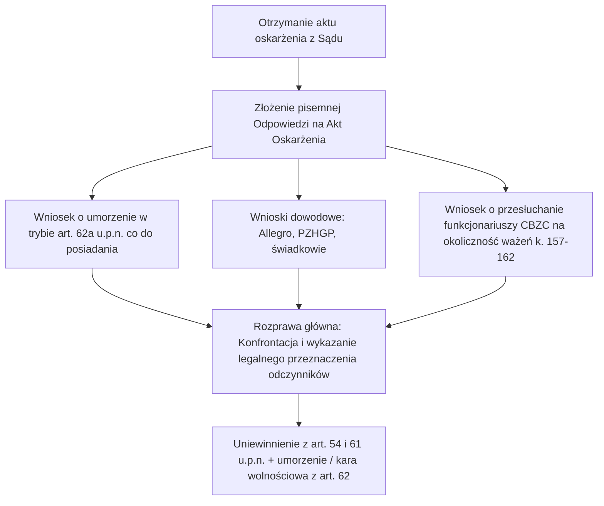

# Kompleksowa Strategia Obrony w Sprawie Karnej przed Sądem Rejonowym w Lubaniu

**Sygnatura śledztwa:** 4327-0.Ds.517.2025  
**Sąd właściwy:** Sąd Rejonowy w Lubaniu, II Wydział Karny  
**Oskarżony:** Marcin Pałka  
**Kwalifikacja z aktu oskarżenia:** art. 62 ust. 1, art. 54 ust. 1, art. 61 ustawy o przeciwdziałaniu narkomanii w zw. z art. 11 § 2 k.k. w zw. z art. 64 § 1 k.k.

---

## 🎯 Główne Cele Strategiczne Obrony

1. **Całkowite uniewinnienie z zarzutu z art. 54 ust. 1 i art. 61 u.p.n.** (zarzut usiłowania/przygotowania do produkcji poprzez posiadanie przyrządów i prekursorów).
2. **Umorzenie postępowania na podstawie art. 62a u.p.n.** co do zarzutu posiadania z art. 62 ust. 1 u.p.n. (ilość nieznaczna na własny użytek).
3. **Obalenie zarzutu recydywy z art. 64 § 1 k.k.** lub wykazanie braku tożsamości rodzajowej/zbiegu warunków.
4. **Wykorzystanie dowodowe faktu rażącego zmanipulowania wstępnych mas substancji przez CBZC** (protokoły komisyjnego ważenia k. 157–162 jako dowód braku wiarygodności relacji funkcjonariuszy CBZC).

---

## ⚖️ Filar I: Demontaż Zarzutów z art. 54 ust. 1 i art. 61 u.p.n. (Przyrządy i Odczynniki)

### 1. Legalne źródło pochodzenia (Allegro.pl) i legalny cel gospodarczy
- **Stan faktyczny**: Zabezpieczone odczynniki chemiczne i rozpuszczalniki (aceton, toluen, siarczan miedzi, kwas octowy, chlorek miedzi, środki czyszczące) oraz zlewki i kolby zostały legalnie zakupione na platformie **Allegro.pl** na potrzeby:
  - **Prowadzonej hodowli gołębi pocztowych** (dezynfekcja gołębników, zwalczanie pasożytów, siarczan miedzi i odczynniki stosowane w hodowli ptaków),
  - **Trwającego remontu i prac wykończeniowych lokalu** przy ul. Leśnej 25/4 (odtłuszczacze, zmywacze farb, rozcieńczalniki do malowania, środki udrażniające).
- **Podstawa prawna i linia orzecznicza SN**:
  - Zgodnie z utrwalonym orzecznictwem Sądu Najwyższego (m.in. **wyrok SN z 10.05.2017 r., IV KK 437/16** oraz **I KZP 24/01**): *Samo posiadanie przedmiotów lub odczynników powszechnego użytku gospodarczego nie wypełnia znamion z art. 54 ust. 1 ani art. 61 u.p.n., jeżeli oskarżony nie podjął bezpośrednich czynności adaptacyjnych wskazujących na ich wyłączne i jednoznaczne przeznaczenie do nielegalnej produkcji*.
  - Prokuratura nie zabezpieczyła działającej linii produkcyjnej ani gotowego produktu w ilościach handlowych, a jedynie standardowe szkło i odczynniki dostępne bez zezwoleń w powszechnym obrocie handlowym.

### 2. Wnioski dowodowe do zgłoszenia:
1. **Historia zakupów i faktury z Allegro.pl**: wykazanie dat zakupu, nazw sprzedawców, legalnego obrotu i braku konspiracji przy nabywaniu substancji.
2. **Dokumentacja hodowli gołębi pocztowych**: zaświadczenia z Polskiego Związku Hodowców Gołębi Pocztowych (PZHGP), wykaz preparatów pielęgnacyjnych, protokoły dezynfekcji.
3. **Zdjęcia i dokumentacja remontowa lokalu ul. Leśna 25/4**: potwierdzenie prowadzonych prac malarskich i instalacyjnych.

---

## 🍃 Filar II: Walka o Umorzenie z art. 62a u.p.n. (Zarzut Posiadania)

### 1. Rzeczywiste ilości po komisyjnym ważeniu
- Początkowo CBZC i prokuratura zarzuciły: **34,96 g metamfetaminy i 7,59 g marihuany**.
- W wyniku wniosku obrony o komisyjne otwarcie bezpiecznych kopert i ponowne ważenie (k. 157–162) ustalono rzeczywistą masę:
  - metamfetamina: **0,42 g**,
  - mieszanina kokainy i metamfetaminy: **0,09 g**,
  - kokaina: **1,38 g**,
  - marihuana: **0,26 g** (tzw. „na lufkę”).
- Są to bezsprzecznie **ilości nieznaczne**, przeznaczone wyłącznie na doraźny, własny użytek oskarżonego.

### 2. Zastosowanie art. 62a u.p.n.
> *„Jeżeli przedmiotem czynu, o którym mowa w art. 62 ust. 1 lub 3, są środki odurzające lub substancje psychotropowe w ilości nieznacznej, przeznaczone na własny użytek sprawcy, postępowanie można umorzyć również przed wydaniem postanowienia o wszczęciu śledztwa lub dochodzenia, jeżeli orzeczenie wobec sprawcy kary byłoby niecelowe ze względu na okoliczności popełnienia czynu, a także stopień jego społecznej szkodliwości.”*

- **Argumentacja**:
  - Oskarżony sam wskazał funkcjonariuszom miejsce przechowywania śladowych ilości w domu rodziców (ul. Stawowa 6),
  - Z opinii biegłych psychiatrów z 16.08.2025 r. wynika, że u oskarżonego rozpoznano uzależnienie mieszane (F19.2), co uzasadniało posiadanie śladowej ilości na własne potrzeby, a właściwą reakcją państwa powinno być leczenie odwykowe, a nie kara bezwzględna.

---

## 🚫 Filar III: Wykazanie Poważnych Naruszeń CBZC i Przebiegu Zatrzymania

### 1. Prowokacja i bezprawny przymus podczas zatrzymania pod sklepem (ul. Groblowa, 09.04.2025 r.)
- **Fikcyjna stłuczka i zasadzka**: Funkcjonariusze CBZC posłużyli się podstępem — zaczepili kolegę pod sklepem przy **ul. Groblowej** pod pretekstem rzekomego zarysowania auta, by ściągnąć oskarżonego.
- **Fałszowanie miejsca w protokole**: W protokole zatrzymania funkcjonariusze wpisali jako miejsce **ul. Leśna 24**, tuszując rzeczywiste miejsce fizycznego zatrzymania pod sklepem na **ul. Groblowej** i ukrywając prowokację.
- **Naruszenie godności i praw rodziny**:
  - Użycie nieproporcjonalnej siły w obecności 5-letniego dziecka (syn Miłosz),
  - Zastraszanie małżonki oskarżonego (groźby odebrania dziecka, utraty pracy w banku) celem wymuszenia podania adresu ul. Leśna 25/4,
  - Brak okazania legitymacji w sposób umożliwiający identyfikację funkcjonariuszy.

### 2. Sfałszowanie wstępnych ilości (35g vs 2g)
- **Kompromitacja wiarygodności CBZC**: Różnica rzędu ponad 1500% pomiędzy tym, co policjanci CBZC wpisali w protokołach wstępnych (35g), a tym, co fizycznie znajdowało się w zabezpieczonych pakietach (0,26g i 1,8g), stanowi **koronny dowód na próbę sztucznego wykreowania „znacznej ilości”** i nielegalnej fabryki.

---

## 📋 Plan Działań Procesowych przed Sądem

### Wnioski dowodowe do natychmiastowego sformułowania:
1. **Wniosek o przesłuchanie w charakterze świadków**:
   - Małżonka Maria Kaźmierczak-Pałka (na okoliczność przebiegu zatrzymania, presji, braku narkotyków w lokalu remontowanym, posiadania jedynie ilości śladowych na Stawowej 6),
   - Kolega zatrzymany pod sklepem (na okoliczność fikcyjnej stłuczki i prowokacji CBZC),
   - Funkcjonariusze CBZC (na okoliczność rozbieżności wagowych w protokołach).
2. **Wniosek o dopuszczenie dowodu z dokumentów**:
   - Wyciągi z rachunku bankowego / konta Allegro potwierdzające zakupy odczynników chemicznych jako materiałów do czyszczenia i hodowli gołębi,
   - Zaświadczenie o członkostwie w PZHGP i rejestracji hodowli gołębi pocztowych.
3. **Wniosek z art. 62a u.p.n.**: o umorzenie postępowania w części dotyczącej posiadania substancji ze względu na znikomą ilość i przeznaczenie na własny użytek.
