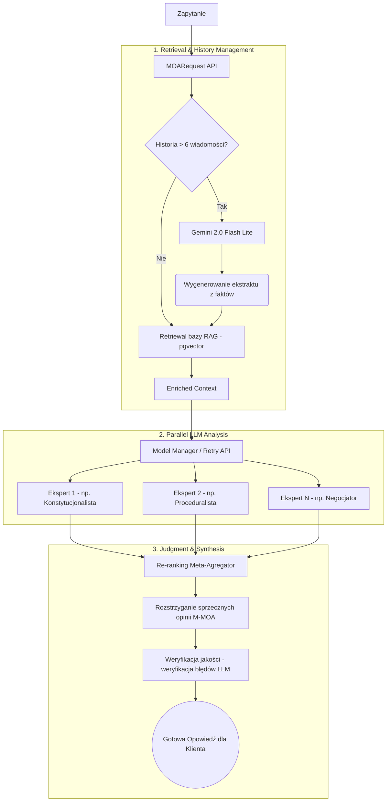

# Raport Analityczny: System Promptów i Przepływ Informacji (LexMind v4.4)

> [!NOTE]
> Poniższy raport stanowi architektoniczną dekompozycję silnika prawniczego **LexMind MOA (Mixture of Agents) v4.4 — Supreme Symmetrical Dual Engine**. Dokumentuje on działania zaimplementowane w modułach `prompt_builder.py`, `llm_agents.py`, `pipeline.py` oraz `synthesizer.py`.

---

## 1. Architektura "Dual Engine" (Symetria Ról)

Core systemu operuje na zdefiniowanych dwóch potężnych "wszechświatach" (Universes), które determinują cały dalszy proces poznawczy modeli. Konstrukcja ta zapewnia pełną spójność psychologiczną sztucznej inteligencji:

*   🛡️ **Defense Universe (IdentityMode.ADVOCATE):** Modele wcielają się w role członków elitarnego "Sztabu Obrony" (*Dream Defense Team*). Główna dyrektywa to *CLIENT_SUPREMACY* oraz *PRESUMPTION_OF_INNOCENCE*. System ma za zadanie agresywnie szukać dziur proceduralnych, konstytucyjnych oraz podważać narzucaną narrację aktu oskarżenia lub pisma procesowego.
*   ⚔️ **Prosecution Universe (IdentityMode.JUDGE):** Architektura zimnego "Aparatu Oskarżycielskiego" (*Prosecution Machine*). Modele skupiają się na budowaniu niepodważalnych aktów oskarżeń, stosując standard *BEYOND_REASONABLE_DOUBT*. Są tu brutalnie weryfikujące luki w alibi oskarżonego i nakierowane na maksymalizacje wymiaru kary lub utrzymanie rygoru decyzji.

Wybór trybu (`mode`) na samym początku zapytania (w `MOARequest`) przełącza całą macierz promptów "w locie".

---

## 2. Wielowarstwowa Konstrukcja Promptów (Prompt Builder)

Każdy prompt wysyłany do modeli analitycznych jest składany dynamicznie z 5 izolowanych warstw, co zapewnia mu maksymalną odporność na "rozmycie" uwagi przez model (tzw. *attention drift*).

1.  **Warstwa Tożsamościowa (Core Identity):** Definiuje nadrzędny wektor działania "Kim jesteś i jaka jest twoja misja".
2.  **Warstwa Epistemiczna:** Bardzo ostre restrykcje ograniczające halucynacje prawne (*Zakaz konfabulacji*, ograniczanie wiedzy tylko do bazy RAG i dostarczonego dokumentu -  tzw. *Data Sovereignty*).
3.  **Warstwa Komunikacyjna (Communication Layer):** Wymusza naturalny, adwokacki styl wypowiedzi: pełne zdania, empatia, podawanie przykładów z życia, absolutny zakaz stosowania emoji i punktowego raportowania podczas dialogu z klientem. Zabezpiecza przed "robotycznym" stylem LLM.
4.  **Warstwa Roli (System Role):** Precyzyjne zadanie aktorskie dla konkretnego modelu (np. *The Proceduralist*, *The Forensic Expert*, *The Negotiator*). Każe modelowi skupić się tylko na określonym wycinku pracy prawniczej.
5.  **Warstwa Metodologii (Task):** Dokładny przepis postępowania (np. dla *Document Attack* mamy procedurę: Kwalifikacja $\rightarrow$ Luki/Sprzeczności $\rightarrow$ Rekomendacja z terminami). 

---

## 3. Przepływ Informacji (MOA Pipeline Flow)

Przepływ informacji jest silnie zoptymalizowany pod kątem stabilności i ograniczania pamięci tokenów:

### Narzędzia stabilizujące Backend:
*   **Optymalizacja Pamięci Podręcznej:** Jeśli historia przekracza próg 6 konwersacji, wdrażany jest superszybki model (obecnie `google/gemini-2.0-flash-lite:preview`), którego jedynym zadaniem jest ekstrakcja i streszczenie *suchych* faktów (bez interpretacji z wewnątrz). Ten czysty "ekstrakt" dodawany jest przed wynikami RAG. Do samego potoku ekspertów wrzuca się tylko 4 ostatnie surowe wiadomości. Znacznie minimalizuje to zużycie pamięci *context window* dużych modeli.
*   **Async Connection Pooling:** `pipeline.py` współdzieli jedno bazowe połączenie w obszarze `AsyncOpenAI`, aby optymalizować ruch sieciowy do zewnętrznych providerów np. OpenRouter.
*   **Robust LLM Manager z Fallbackiem (`llm_agents.py`)**: Utrzymuje "State" na wypadek wystąpienia tzw. *Rate Limitów* (HTTP 429). Zawiera zaawansowany "Exponential Backoff" (pętla z postępującym wydłużaniem czasu na wstrzymanie wątku - min. opóźnienie * retry iteracja) - ratuje zapytanie.
*   **Sędzia Meta-Anotujący (`synthesizer.py`):** Działa jako re-ranking LLM. Wczytuje oryginalny RAG, dokument i listę ekspertyz od warstwy "pod nim". Ma rygorystyczne wytyczne co do zunifikowania logiki, eliminacji sprzeczności i ostatecznego ubrania informacji w miękki, naturalny output.

---

## 4. Konkluzje Architektoniczne

Kod realizuje **zaawansowany proces Agentowej Orkiestracji (Multi-Agent Orchestration)**, wykraczając ponad podstawowe skrypty RAG. Rozbicie operacji na *Dynamiczne Ścieżki Osobowości* i wymuszenie procedur dla każdej "Roli", nie dopuszcza do powstawania ogólnikowych i płytkich zaleceń. Sposób kompresji historii rozmów oraz kontroli rate-limitów poprzez inteligentny fallback świadczy o wysokiej gotowości produkcyjnej i świetnym przebyciu granicy MVP.
