# LexMind — Information Flow Architecture & Response Generation Pipeline

**Dokument architektoniczny na podstawie kodu produkcyjnego**  
(`services/orchestrator.py`, `config.py`, `retrieval_service.py`, `services/investigation/*`, migracja `supabase/migrations/20260520_hybrid_search_deploy.sql`).

**Data:** 2026-05-20  
**Wersja systemu:** LexMind LegalTech AI — V2 Orchestrator

---

## Spis treści

1. [Executive map](#0-executive-map--stan-faktyczny-vs-docelowy)
2. [Aktualny pipeline — etap po etapie](#i-aktualny-pipeline--etap-po-etapie-input--output)
3. [Przepływ tokenów i kontekstu](#ii-przepływ-tokenów-i-kontekstu-as-is)
4. [Memory architecture](#iii-memory-architecture)
5. [Retrieval strategy](#iv-retrieval-strategy--as-is-vs-ideal)
6. [Orchestration strategy](#v-orchestration-strategy)
7. [Agent architecture](#vi-agent-architecture-ideal)
8. [Expert debate system](#vii-expert-debate-system-ideal)
9. [Procedural reasoning & attack engine](#viii-procedural-reasoning--attack-engine)
10. [Litigation strategy engine](#ix-litigation-strategy-engine)
11. [Autonomous legal research loop](#x-autonomous-legal-research-loop)
12. [Citation verification & hallucination prevention](#xi-citation-verification--hallucination-prevention)
13. [Confidence scoring](#xii-confidence-scoring-ideal)
14. [Dynamic model routing](#xiii-dynamic-model-routing)
15. [Semantic chunking & long-context](#xiv-semantic-chunking--long-context)
16. [Timeline extraction & issue spotting](#xv-timeline-extraction--issue-spotting)
17. [Final response generator](#xvi-final-response-generator-harvey--cocounsel-class)
18. [Diagramy zbiorcze](#xvii-diagramy-zbiorcze)
19. [TOP 20 — bottlenecki](#xviii-top-20--bottlenecki-z-kodu)
20. [TOP 20 gamechangers](#xix-top-20-gamechangers)
21. [TOP 20 upgrades](#xx-top-20-enterprise--ux--reasoning-upgrades)
22. [Oceny 1–10](#xxi-oceny-110--stan-obecny)
23. [FINAL IDEAL ARCHITECTURE](#xxii-final-ideal-architecture--blueprint-lexmind-enterprise)
24. [Podsumowanie operacyjne](#podsumowanie-operacyjne)

---

## 0. Executive map — stan faktyczny vs. docelowy

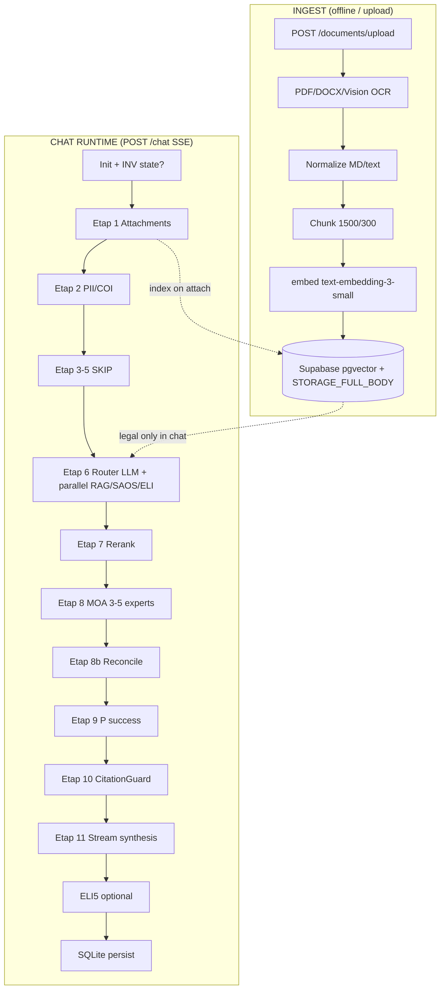

**Krytyczna luka architektoniczna:** `use_rag_user = False` (linia 739 `orchestrator.py`) — pełna infrastruktura `knowledge_base_user` jest indeksowana, ale **nie uczestniczy w retrieval czatu**. Kontekst sprawy idzie przez `extracted_text` w prompcie, nie przez hybrid search user KB.

### Mapowanie plików źródłowych

| Warstwa | Ścieżki |
|--------|---------|
| API | `api.py`, `routes/chat_v2.py`, `routes/documents.py` |
| Orkiestracja | `services/orchestrator.py` |
| Pipeline | `services/pipeline/attachments.py`, `rag_retrieval.py`, `fast_path.py` |
| RAG | `services/retrieval_service.py`, `indexing_service.py`, `rerank_service.py` |
| MOA | `moa/http_client.py`, `moa/config.py`, `moa/saos.py` |
| Investigation | `services/investigation/*` |
| DB lokalna | `database.py` (SQLite) |
| DB wektorowa | `supabase/migrations/20260520_hybrid_search_deploy.sql` |
| Prompty | `prompts/*.txt`, `prompts/loader.py` |

---

## I. Aktualny pipeline — etap po etapie (INPUT → OUTPUT)

Dla każdego etapu: **INPUT | PROCESSING | OUTPUT | MODELS | TOKENS | MEMORY | LATENCY | FAILURE POINTS | QUALITY RISKS | OPTIMIZATION METHODS**

---

### Etap 0 — Inicjalizacja sesji

| Pole | Wartość |
|------|---------|
| **INPUT** | `session_id`, `chat_history[]`, `expert_models[]`, `use_saos`, `use_eli`, `response_mode`, `feature_investigation_v2` |
| **PROCESSING** | `load_case_state_for_session` → `CaseInvestigationState` (tylko gdy `LEXMIND_FEATURE_INVESTIGATION_V2=true`) |
| **OUTPUT** | `inv_state` z overlay pamięci hipotez / open_questions |
| **MODELS** | — |
| **TOKENS** | 0 |
| **MEMORY** | SQLite `session_investigation.state_json` (AES) |
| **LATENCY** | 5–50 ms |
| **FAILURE** | Brak migracji tabeli investigation |
| **QUALITY RISK** | INV domyślnie OFF — cały moduł śledztwa martwy w prod |
| **OPTIMIZATION** | Włączyć INV dla spraw wieloetapowych; warm-cache state w Redis |

---

### Etap 1 — Upload / ekstrakcja (HTTP + czat)

| Pole | Wartość |
|------|---------|
| **INPUT** | `attachments[]` (PDF/DOCX/PNG/JPG), `document_text` |
| **PROCESSING** | `extract_all_attachments_text()` — pypdf/python-docx; obrazy → OpenRouter vision (`vision_ocr_models`, temp 0.1, max 2000 tok); cache `user_kb_cache` po `source_hash` |
| **OUTPUT** | `extracted_text` (konkatenacja), background `indexing_service.index_text` → `knowledge_base_user` |
| **MODELS** | `google/gemini-2.5-flash`, `flash-lite`, `gpt-4o-mini` (vision) |
| **TOKENS** | ~500–2000 / strona OCR |
| **MEMORY** | `ocr_cache`, Supabase user vectors |
| **LATENCY** | PDF 0.5–3 s; OCR 3–15 s/strona |
| **FAILURE** | Pusty OCR; timeout OpenRouter; skan niskiej jakości |
| **QUALITY RISK** | Heurystyczny PDF→MD bez layout analysis; brak tabel/wyroków strukturalnych |
| **OPTIMIZATION** | Azure Document Intelligence / Unstructured.io + layout JSON; Tesseract jako fallback |

**Indeksacja (offline):** `RecursiveCharacterTextSplitter(1500, 300)` + `get_batch_embeddings` + rekord `STORAGE_FULL_BODY` (pełny tekst do 8000 znaków w embed input).  
**Plik:** `services/document_service.py`, `routes/documents.py`

---

### Etap 2 — Normalizacja / PII / COI

| Pole | Wartość |
|------|---------|
| **INPUT** | `user_query`, `extracted_text`, historia |
| **PROCESSING** | `_mask_pii()` (`services/pii_mask.py`); `_extract_client_addressee()` **przed** maskowaniem; `_check_coi()` regex lista konfliktów |
| **OUTPUT** | `zanonimizowane_zapytanie`, `zanonimizowany_tekst`, `client_addressee`, `coi_conflicts[]` |
| **MODELS** | — |
| **TOKENS** | 0 |
| **MEMORY** | — |
| **LATENCY** | <100 ms |
| **FAILURE** | Nadmierna maska (PESEL/NIP w kontekście prawnym) |
| **QUALITY RISK** | Utrata identyfikatorów sprawy w retrieval query |
| **OPTIMIZATION** | Token-level NER (spaCy PL + custom entities); reversible token vault per `session_id` |

---

### Etap 3–5 — Terminy / pamięć / timeline (WYŁĄCZONE w runtime)

| Pole | Wartość |
|------|---------|
| **INPUT** | — |
| **PROCESSING** | `urgency_alerts=[]`, `timeline_data={}` — hardcoded skip |
| **OUTPUT** | Puste struktury |
| **Kod istnieje** | `deadline_engine.py`, `extract_delivery_dates`, `build_procedural_brief` |
| **QUALITY RISK** | **Utrata kontekstu temporalnego** — model nie wie o terminach procesowych |
| **OPTIMIZATION** | Aktywować Etap 3: deterministic deadline graph + alert injection do `combined_context` |

---

### Etap 6 — Retrieval orchestration

| Pole | Wartość |
|------|---------|
| **INPUT** | `query_for_retrieval` (query + historia do 4000 znaków), `act_terms`, flagi źródeł |
| **PROCESSING** | (a) Router LLM 40 tok / 15 s (`router_keywords_system.txt`) LUB `fast_path_keywords`; (b) `parallel_rag_gather`; (c) opcjonalnie INV: hipotezy + `RecursiveResearchLoop` |
| **OUTPUT** | `legal_res[]`, `user_res=[]`, `saos_results[]`, `eli_results[]` |
| **MODELS** | Router: `primary_model`; embed: `openai/text-embedding-3-small` |
| **TOKENS** | Router ~200 in / 40 out; 1× embed query ~500 in |
| **MEMORY** | `rag_cache` TTL 300 s, max 128 |
| **LATENCY** | 2–8 s (parallel); INV +3–20 s |
| **FAILURE** | HTTP 404 `hybrid_search_*` → fallback pure vector; SAOS rate limit; ELI brak po samym `art.` |
| **QUALITY RISK** | Router 40 tok → słabe frazy; SAOS/ELI nie rerankowane; user RAG off |
| **OPTIMIZATION** | Patrz sekcja [Hybrid Retrieval](#iv-retrieval-strategy--as-is-vs-ideal) |

**Supabase hybrid (gdy migracja wdrożona):**

```sql
hybrid_search_legal(query_text, query_embedding vector(1536), act_terms)
-- RRF: vector_weight=0.45, k_rrf=60, match_count×3 candidates
```

**Struktura rekordu:**

```json
{
  "id": 123,
  "content": "...",
  "metadata": {
    "filename": "...",
    "act_terms": [],
    "source_file_hash": "...",
    "chunk_index": 0
  },
  "rrf_score": 0.031
}
```

**SAOS:** `GET https://www.saos.org.pl/api/search/judgments` — max 3 zapytania z `_external_search_queries`.  
**ELI:** `GET https://api.sejm.gov.pl/eli/acts/search` — preferencja tytułu ustawy (`_eli_act_titles_from_context`).

**Fast path:** `rag_n=4`, `saos_n=2`, `eli_n=0` — celowo obcina ELI.

**Pliki:** `services/pipeline/rag_retrieval.py`, `services/retrieval_service.py`

---

### Etap 7 — Reranking

| Pole | Wartość |
|------|---------|
| **INPUT** | `legal_res`, `query_for_retrieval[:4000]` |
| **PROCESSING** | `rerank_legal_chunks` → `heuristic_rerank` (RRF + keyword boost max 0.35) LUB `cohere rerank-multilingual-v3.0` (`LEXMIND_RERANK_PROVIDER=cohere`) |
| **OUTPUT** | `reranked_legal` top_k=8 |
| **MODELS** | Cohere (opcjonalnie) |
| **TOKENS** | Cohere: ~8×4000 znaków dokumentów |
| **LATENCY** | Heuristic <50 ms; Cohere 200–800 ms |
| **FAILURE** | Brak `COHERE_API_KEY` → fallback heuristic |
| **QUALITY RISK** | SAOS/ELI **nie przechodzą reranku** — trafiają surowe top-5 do kontekstu |
| **OPTIMIZATION** | Cross-encoder rerank na **wszystkich** źródłach; ColBERTv2 / Jina reranker v2 |

**Plik:** `services/rerank_service.py`

---

### Etap 8 — Expert debate (MOA)

| Pole | Wartość |
|------|---------|
| **INPUT** | `combined_context` (max 14k po kompresji), `full_doc`, `expert_models[0..n]` |
| **PROCESSING** | `route_agent_specs()` → 3–5 agentów równolegle; `_expert_context_with_chunk` — max 4 chunki 8000/400, overview 3500; prompty + guards |
| **OUTPUT** | `agent_results[]`, `researcher_responses` |
| **MODELS** | Slot 0–2: doktryna / procedura / kontr; spawn: procedural, tax, eu, human_rights |
| **TOKENS** | ~3–5 × (10k context + 2600 out) ≈ **45k–80k** input equivalent |
| **MEMORY** | Brak zapisu per-agent — tylko w `final_metadata` |
| **LATENCY** | max(agent) 75–90 s; typowo 25–45 s wall |
| **FAILURE** | Pusta odpowiedź → retry `primary_model`; timeout 75 s |
| **QUALITY RISK** | Eksperci widzą **ten sam** RAG block — tylko dokument split; brak prawdziwej adversarial cross-exam |
| **OPTIMIZATION** | Patrz [Expert Debate System](#vii-expert-debate-system-ideal) |

**Skip debaty:** `chat_mode==single` OR `is_fast_statutory_query` OR `debate_on_single=False`.

**Pliki:** `services/investigation/agent_router.py`, `prompts/prompt_agent_*.txt`

---

### Etap 8b — Reconcile debate

| Pole | Wartość |
|------|---------|
| **INPUT** | 3 pierwsze analizy ekspertów |
| **PROCESSING** | `_reconcile_expert_debate()` — LLM protokół zgodności/sprzeczności |
| **OUTPUT** | `debate_protocol` wstrzyknięty do syntezy |
| **TOKENS** | ~6–8k in, ~800 out |
| **LATENCY** | 5–15 s |
| **QUALITY RISK** | Reconcile tylko 3 agentów — spawn 4–5 ignorowany w protokole głównym |

---

### Etap 9 — P(Sukces)

| Pole | Wartość |
|------|---------|
| **INPUT** | Regex `%` z odpowiedzi ekspertów |
| **PROCESSING** | Średnia ważona (1.0, 0.8, 0.7) × `(1 - R_procesowe)`; `R_procesowe` z terminy (wyłączone → 0) |
| **OUTPUT** | `p_sukces_val` opcjonalnie |
| **QUALITY RISK** | **Niereprezentatywne** — zależy od czy ekspert wpisze %; brak kalibracji Bayes |

---

### Etap 10 — Citation audit

| Pole | Wartość |
|------|---------|
| **INPUT** | `researcher_responses`, korpus: doc + RAG + SAOS + ELI |
| **PROCESSING** | `CitationGuard.audit`: regex `art.` → corpus match → `verify_citations_via_eli` → `verify_citations_via_llm` |
| **OUTPUT** | `hallucinated_cites`, `confidence_score` 40–99 |
| **MODELS** | LLM audit (wyłączony w fast path) |
| **TOKENS** | Audit LLM ~2–4k |
| **BLOCK** | `hallucination_block_min_cites = 99` → **blokada praktycznie martwa** |
| **QUALITY RISK** | Corpus match wymaga `art.` + numer w tekście — nie weryfikuje treści merytorycznej artykułu |
| **OPTIMIZATION** | Patrz [Citation Verification](#xi-citation-verification--hallucination-prevention) |

**Plik:** `services/citation_guard.py`

---

### Etap 11 — Final synthesis (stream)

| Pole | Wartość |
|------|---------|
| **INPUT** | `system_content` (architect + 10+ guards), `advisor_prompt` (debate + RAG 5k + SAOS/ELI 4k) |
| **PROCESSING** | `_call_with_fallback_stream`; chunk timeout **60 s**; drugi audit cytowań na `final_answer` |
| **OUTPUT** | SSE `chunk`, `final_metadata` |
| **MODELS** | `judge_model` / `aggregator_model` / `selected_model` |
| **TOKENS** | 2200 (fast) / 4200 (normal) out; ~25–35k in |
| **LATENCY** | 15–90 s TTFT + stream |
| **FAILURE** | Stream timeout; fallback raw expert dumps |

**Warstwy promptów (kaskada):**

1. Rola: `architect_default` / `architect_citizen` / `architect_draft`
2. Guards: `strict_no_quote`, `anti_paraphrase`, `coherence_synthesis`, `advisor_synthesis`, `litigation_strategic` (tryb strategic)
3. `multi_stage_synthesis.txt` (feature on)
4. `judge_debate_synthesis.txt` (jeśli debata)
5. User: raporty ekspertów + RAG + P(Sukces)

---

### Etap 12 — ELI5

| Pole | Wartość |
|------|---------|
| **INPUT** | `final_answer[:4000]` |
| **PROCESSING** | Osobne wywołanie LLM max 300 tok |
| **OUTPUT** | `eli_explanation` → SQLite |
| **LATENCY** | 3–10 s |
| **QUALITY RISK** | Drugi pass bez cytowań — może uprościć błędnie |

---

## II. Przepływ tokenów i kontekstu (as-is)

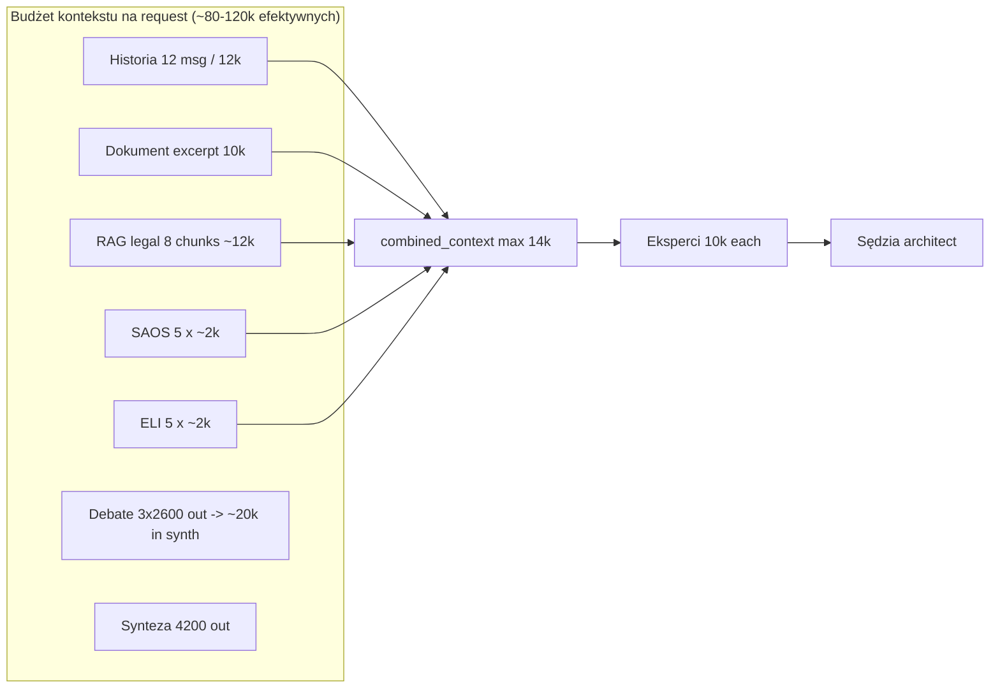

### Limity z `config.py`

| Parametr | Wartość |
|----------|---------|
| `document_context_chars` | 10_000 |
| `chunk_size_chars` / overlap | 8000 / 400, max 4 chunki |
| `chat_history_max_messages/chars` | 12 / 12_000 |
| `context_summary_max_chars` | 14_000 |
| Router keywords | 40 tokens, timeout 15s |
| Eksperci | 2600 tokens, timeout 75s |
| Synteza | 4200 (normal) / 2200 (fast), timeout 90/55s |

### Utrata kontekstu — miejsca krytyczne

1. `context_summary_max_chars=14000` — head 65% + tail 35% wycina środek (SAOS/ELI/procedural).
2. `document_context_chars=10000` — długie akta bez pełnego RAG user.
3. `max_chunks=4` przy 8000 znaków — ~32k z 200+ stron.
4. Debata → synteza: tylko 5k RAG w `advisor_prompt` mimo 8 reranked.
5. Fast path: zero ELI, skrócona debata.

---

## III. Memory architecture

### As-is (3 warstwy + martwa 4.)

| Warstwa | Storage | Zakres | TTL |
|---------|---------|--------|-----|
| **L0 Request** | RAM | `combined_context`, debate | request |
| **L1 Chat** | SQLite `messages` | 12 msg / 12k, encrypted | sesja |
| **L2 Investigation** | SQLite `session_investigation` | hipotezy, tags, rounds | sesja (INV off) |
| **L3 Legal KB** | Supabase `knowledge_base_legal` | ustawy, komentarze | permanent |
| **L3b User KB** | Supabase `knowledge_base_user` | uploady | **nieużywane w czacie** |
| **L4 Full body** | metadata `storage_role=STORAGE_FULL_BODY` | pełny tekst pliku | permanent |

### Ideal — hierarchical memory (enterprise)

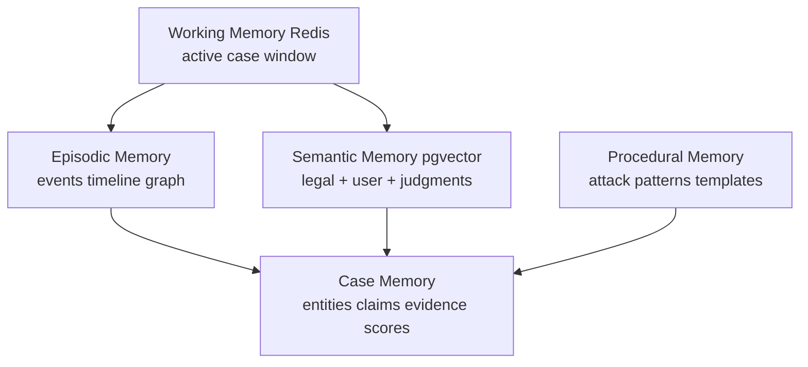

**Struktura danych (docelowe):**

```typescript
interface CaseMemory {
  case_id: UUID;
  entities: { parties: Entity[]; organs: Entity[]; courts: Entity[] };
  claims: Claim[];
  timeline: TimelineEvent[];
  open_issues: Issue[];
  strategy_state: LitigationStrategy;
  retrieval_profile: { act_terms: string[]; saos_queries: string[] };
  version: number;
}
```

**Zapis:** po każdym Etap 6/10/11 — delta merge do `case_memory` (nie tylko INV flag).

---

## IV. Retrieval strategy — as-is vs ideal

### As-is

- **Legal:** hybrid RRF (vector 0.45 + FTS polish) → heuristic rerank → top 8.
- **User:** disabled (`use_rag_user=False`).
- **SAOS/ELI:** keyword router, brak embedding, brak rerank, top 5 concat.

### Ideal — Hybrid Retrieval v3

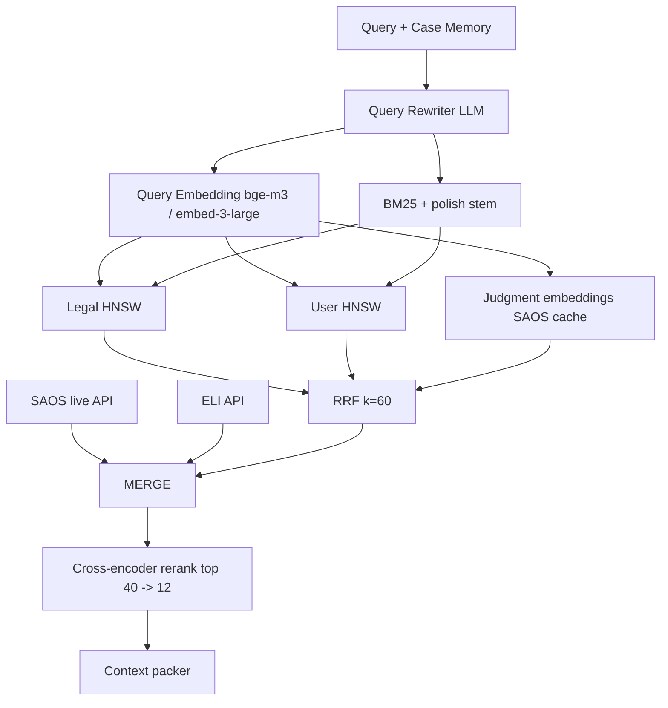

| Krok | Algorytm | Parametry |
|------|----------|-----------|
| Dense | HNSW cosine | ef_search=128, M=16 |
| Sparse | `websearch_to_tsquery('polish')` | w migracji SQL |
| Fusion | RRF | k=60, w_vector=0.4–0.6 dynamic |
| Rerank | `cohere rerank-v3.5` lub `mxbai-rerank-large-v2` | top_n=12 z 40 |
| Dedup | MinHash na `content_hash` | threshold 0.85 |

**Query routing:**

- `statutory_lookup` → ELI first, legal second, skip SAOS
- `case_analysis` → user KB + doc chunks + SAOS
- `procedure_attack` → procedural memory + KPA/KPC/PPSA filters

**Embedding upgrade:** `text-embedding-3-large` (3072) lub `BAAI/bge-m3` — wymaga migracji + reindex.

---

## V. Orchestration strategy

### As-is

Monolityczny `OrchestratorService` ~1857 linii, sekwencyjny z `asyncio.gather` punktowym.

### Ideal — Event-driven orchestrator

```python
class PipelineDAG:
    nodes = [
        IngestNode, SecurityNode, PlannerNode,
        RetrieveNode, RerankNode, ReasoningClusterNode,
        CitationNode, SynthesisNode, PostProcessNode,
    ]
    edges = conditional on QueryPlan.intent
```

**Decision routing (intent classifier):**

| Intent | Etapy | Modele |
|--------|-------|--------|
| `ARTICLE_EXPLAIN` | 1→6(legal+eli)→7→11 | 1× flash-lite |
| `DOCUMENT_REVIEW` | pełny + user RAG + debate | flash + r1 |
| `LITIGATION_STRATEGY` | + INV + procedural + adversarial | r1 + opus-class |
| `DRAFT_PLEADING` | draft architect + citation strict | flash + verifier |

**Implementacja:** `QueryPlanner` (mały JSON schema, 200 tok) zamiast keyword router 40 tok.

---

## VI. Agent architecture (ideal)

```mermaid
flowchart TB
  ORCH[Orchestrator] --> PLAN[Planner Agent]
  PLAN --> subgraph REASONING["Reasoning Cluster"]
    MAT[Material Law Agent]
    PROC[Procedure Agent]
    EVID[Evidence Agent]
    STRAT[Strategy Agent]
    ADV[Adversarial Agent]
  end
  REASONING --> JUDGE[Judge Synthesizer]
  JUDGE --> VER[Citation Verifier Agent]
  VER --> OUT[Stream Output]
```

| Agent | Model (OpenRouter) | Rola | Output schema |
|-------|-------------------|------|---------------|
| Planner | `google/gemini-2.5-flash-lite` | intent, etapy, act_terms | JSON `QueryPlan` |
| Material | `deepseek/deepseek-r1` | art. + elementy | `LegalAnalysis` |
| Procedure | `google/gemini-2.5-flash` | terminy, wady | `ProceduralReport` |
| Evidence | `openai/gpt-4o` | fakty vs dokument | `FactMatrix` |
| Strategy | `anthropic/claude-sonnet-4` | warianty | `StrategyOptions` |
| Adversarial | `deepseek/deepseek-r1` | kontr | `CounterClaims` |
| Judge | `google/gemini-2.5-pro` / `openai/gpt-4.1` | synteza | stream text |
| Verifier | `openai/gpt-4o-mini` + deterministic | cytaty | `CitationReport` |

**Komunikacja:** shared `CaseMemory` bus (Redis Streams), nie string concatenation.

---

## VII. Expert debate system (ideal)

**As-is:** równoległe monologi → reconcile 1× → synth.

**Ideal — Structured Debate Protocol (SDP):**

1. **Round 1 — Independent** (obecne).
2. **Round 2 — Cross-examination:** każdy agent dostaje **tylko** claims innych w JSON; musi `attack` / `support` z `evidence_id`.
3. **Round 3 — Moderator:** `deepseek-r1` rozstrzyga sprzeczności z `confidence` per claim.
4. **Output:** `DebateGraph` (nodes=claims, edges=contradiction/support).

**Token budget:** cap 120k reasoning cluster; dynamic: jeśli <3 sprzeczności → skip round 2.

---

## VIII. Procedural reasoning & attack engine

**As-is (INV only):** `ProceduralAttackEngine` = `build_procedural_brief` + `extract_delivery_dates` + LLM JSON `attacks[]`.

**Plik:** `services/investigation/procedural_engine.py`

**Ideal — Procedural Attack Engine v2:**

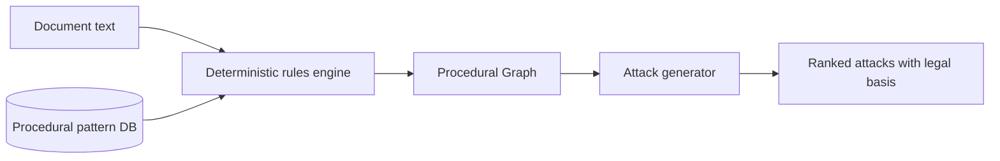

**Komponenty:**

1. **Rule engine:** YAML rules per `stage` (administracja, sąd admin, cywil, karna).
2. **Graph:** `Event(delivery_date)` → `Deadline(rule_id)` → `Attack(severity, cite_art)`.
3. **LLM:** tylko ranking i sformułowanie — **nie** ekstrakcja dat.

```json
{
  "attack_id": "uuid",
  "type": "INVALID_SERVICE|MISSING_NOTICE",
  "severity": 0.85,
  "articles": [{"act": "KPA", "art": "61", "ust": "1"}],
  "evidence_spans": [{"doc_hash": "...", "start": 120, "end": 450}],
  "counter_risk": 0.2
}
```

Aktywować **zawsze** (nie tylko INV) — koszt ~1 LLM call 900 tok.

---

## IX. Litigation strategy engine

**As-is:** `litigation_strategic_guard.txt` + narrative w architect.

**Ideal output schema:**

```json
{
  "options": [
    {
      "name": "attack_decision",
      "steps": [],
      "deadline": "ISO",
      "p_success": 0.62,
      "cost_band": "medium"
    }
  ],
  "recommended": "attack_decision",
  "risks": ["..."]
}
```

Model: `deepseek/deepseek-r1` lub `openai/o3-mini` (structured reasoning).  
Walidacja: każdy krok musi mieć `legal_basis[]` przechodzący CitationGuard.

---

## X. Autonomous legal research loop

**As-is (INV off):** `RecursiveResearchLoop`, `gather_evidence_for_hypotheses`, budget 20 retrieval / 24 LLM.

**Ideal loop:**

```
while budget && open_hypotheses:
  1. generate_hypotheses (LLM)
  2. decompose → sub-queries (HyDE optional)
  3. retrieve parallel (legal, user, SAOS, ELI)
  4. score evidence (cross-encoder)
  5. update hypothesis confidence (Bayesian)
  6. if confidence < θ: refine query; else close
  7. persist to CaseMemory.graph
```

**Stop conditions:** `max_rounds=3`, `Δconfidence < 0.05`, `retrieval_calls >= 20`.

**HyDE:** hipoteza → hypothetical holding paragraph → embed → search (poprawia recall SAOS).

---

## XI. Citation verification & hallucination prevention

### As-is pipeline

`regex extract` → `in_corpus` (substring) → ELI title search → LLM batch audit.

### Ideal — 4-layer verifier

| Layer | Metoda | Latency |
|-------|--------|---------|
| L0 | Regex + normalize act codes | <10 ms |
| L1 | Structured ELI fetch pełnego art. XML | 200–500 ms/cite |
| L2 | Vector match w legal KB | 100 ms |
| L3 | NLI `microsoft/deberta-v3-base` | 50 ms/cite |
| L4 | LLM audit tylko dla `unverified` | 2 s |

**Hallucination policy (enterprise):**

- `hallucination_block_min_cites = 1` dla trybu `draft` / `strategic`
- `confidence_score` kalibrowany na hold-out
- Synteza: **constrained generation** — `ALLOWED_CITATIONS[]` w system prompt

---

## XII. Confidence scoring (ideal)

```python
confidence = (
  0.35 * retrieval_coverage +
  0.25 * citation_verified_ratio +
  0.20 * expert_agreement_score +
  0.10 * source_authority +
  0.10 * (1 - adversarial_damage)
) * coi_penalty * timeline_penalty
```

Wyświetlać **kalibrowany przedział** (np. 72% ± 8%), nie punkt z heurystyki 96.

---

## XIII. Dynamic model routing

| Task | Model | Uzasadnienie |
|------|-------|--------------|
| Router/planner | `gemini-2.5-flash-lite` | szybko, tanio |
| OCR vision | `gemini-2.5-flash` | multimodal PL |
| Deep reasoning | `deepseek/deepseek-r1` | chain-of-thought |
| Synthesis premium | `google/gemini-2.5-pro` / `openai/gpt-4.1` | długi kontekst |
| Citation verify | `gpt-4o-mini` | structured |
| Embedding | `text-embedding-3-large` lub `bge-m3` | recall PL |
| Rerank | `cohere rerank-v3.5` | multilingual |

**Routing service:** latency SLO, cost budget per session, circuit breaker per model (`LLMClientService`).

### Domyślne modele z `config.py`

```python
default_models = [
    "google/gemini-2.5-flash-lite",
    "deepseek/deepseek-r1",
    "google/gemini-2.5-flash",
    "google/gemini-2.5-flash-lite",
    "openai/gpt-4o-mini",
]
embedding = "openai/text-embedding-3-small"  # via OpenRouter, 1536 dims
```

---

## XIV. Semantic chunking & long-context

### As-is

- Index: 1500/300 character splitter (langchain).
- Runtime: 8000/400, max 4.

### Ideal

1. **Legal-aware chunking:** segment po `Art.`, `§`, `Rozdział`, nagłówki orzeczeń.
2. **Parent-child:** child chunk 512 tok, parent 2048 tok (retrieve child, expand parent).
3. **Long-context path:** jeśli `doc_tokens < 120k` → `gemini-2.5-pro` 1M context single-pass.
4. **Map-reduce:** dla >120k — map summaries per section → reduce z RAG.

---

## XV. Timeline extraction & issue spotting

**Timeline (Etap 5 docelowy):**

- NER dat + `extract_delivery_dates` + LLM tylko klasyfikacja typu zdarzenia.
- Output: `TimelineEvent[]` → wykrywanie `gaps`, `inconsistencies`.
- Inject: tabela chronologii na początku `combined_context`.

**Issue spotting:**

- LLM JSON: `issues[]` z IRAC: `issue, rule_candidates[], application_hints[]`
- Mapowanie do `act_terms` dla retrieval.

---

## XVI. Final response generator (Harvey / CoCounsel class)

```
Inputs:
  - DebateGraph (verified claims only)
  - ContextPack (12 reranked, cited)
  - ProceduralReport + StrategyOptions
  - Client profile (addressee, mode)

Process:
  1. Outline pass (JSON sections) — 400 tok
  2. Draft pass (stream) — constrained citations
  3. Verify pass (CitationGuard L0-L3)
  4. Repair pass (tylko błędne akapity) — max 1 retry

Output:
  - stream markdown
  - footnotes [{cite_id, source, span}]
  - eli_explanation (conditional)
  - export DOCX/PDF (pandoc pipeline)
```

**Różnica vs as-is:** osobny **repair** zamiast append warning; footnotes z `source_file_hash` + offset.

---

## XVII. Diagramy zbiorcze

### Ideal flowchart systemu

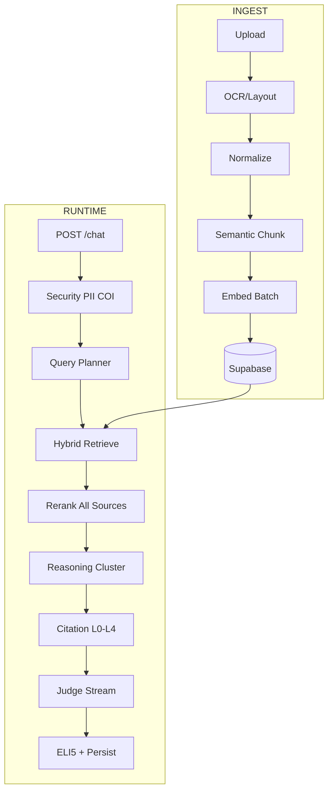

### Diagram agentów (ideal)

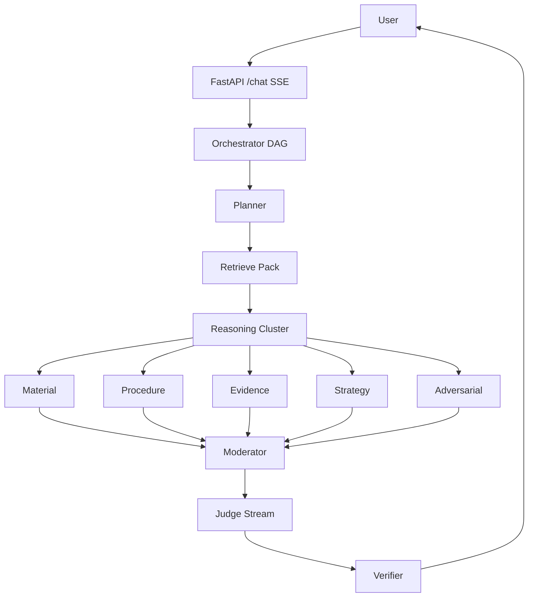

### Diagram retrieval pipeline

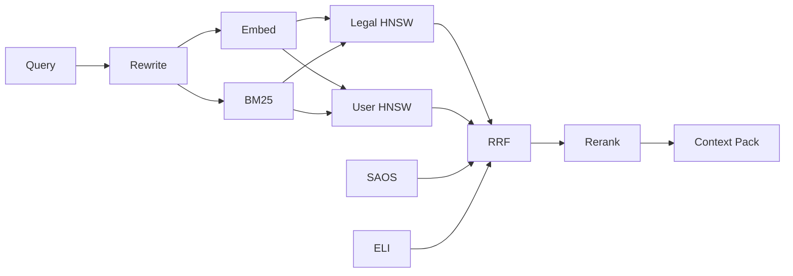

### Diagram orchestracji

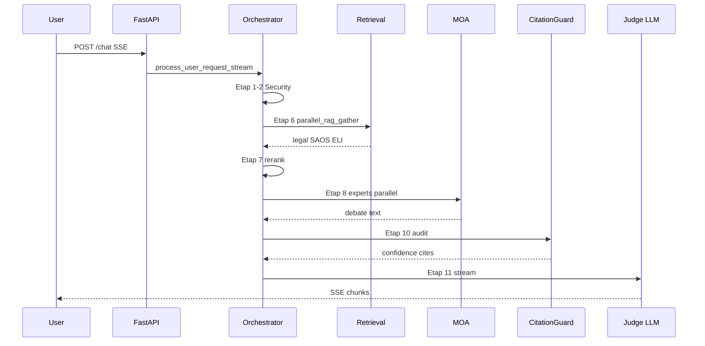

### Diagram decision routing

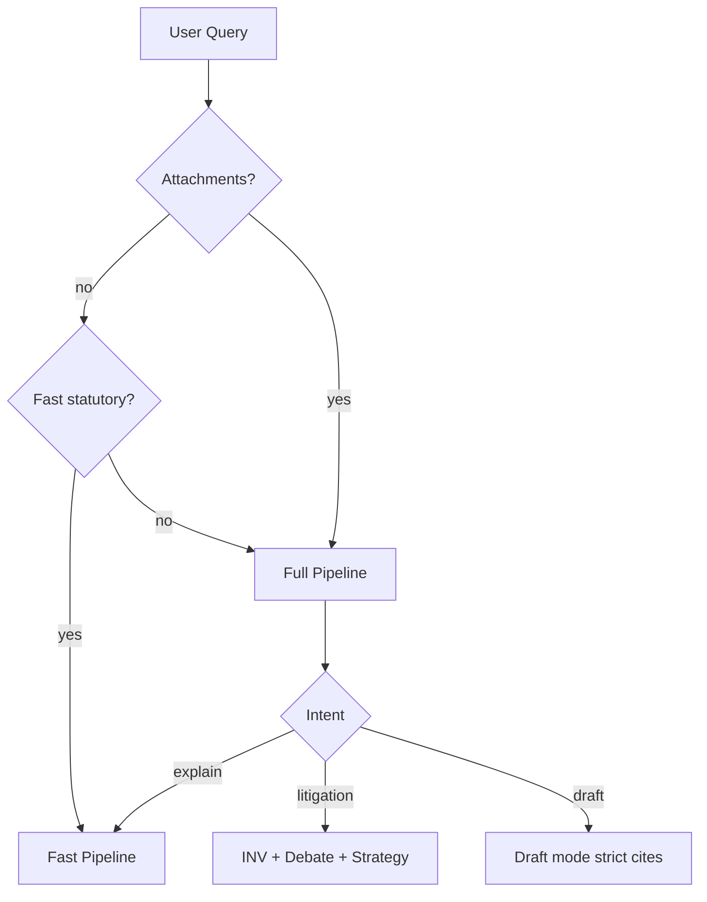

### Diagram lifecycle dokumentu

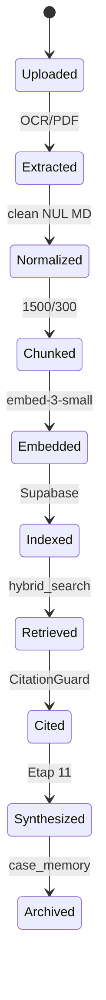

### Diagram pamięci

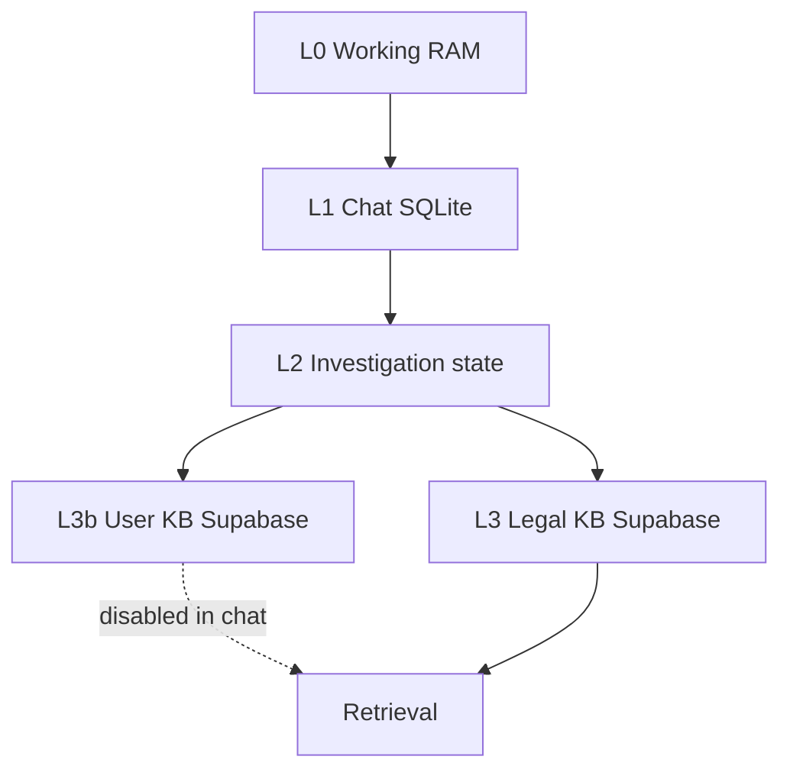

---

## XVIII. TOP 20 — bottlenecki (z kodu)

| # | Bottleneck | Impact |
|---|------------|--------|
| 1 | `use_rag_user=False` | Brak semantycznego search po aktach klienta |
| 2 | Sekwencyjne embeddingi przy indeksacji | Upload 100+ stron = minuty |
| 3 | 3–5 ekspertów × 75 s timeout | Tail latency 45–90 s |
| 4 | Podwójny CitationGuard (debate + synth) | +5–15 s |
| 5 | ELI5 jako 3. wywołanie LLM | +3–10 s |
| 6 | `context_summary` 14k truncate | Utrata środka kontekstu |
| 7 | SAOS/ELI bez rerank | Szum w prompcie |
| 8 | Router 40 tok | Słabe zapytania retrieval |
| 9 | `hallucination_block_min_cites=99` | Brak twardej ochrony |
| 10 | INV domyślnie OFF | Brak rekurencji/strategii |
| 11 | Etap 3–5 wyłączone | Brak terminów/timeline |
| 12 | Hybrid RPC nie wdrożony | Pure vector gorszy recall |
| 13 | `PostgresHybridSearch` nieużywany | Duplikacja logiki |
| 14 | Stream chunk timeout 60 s | Fałszywe przerwanie |
| 15 | `rag_cache` 300 s | Stare prawo w długiej sesji |
| 16 | Jedna embedding model dla query/doc | Suboptimal recall |
| 17 | Debate reconcile tylko 3 agentów | Spawn 4–5 ignorowany |
| 18 | Brak kolejki OpenRouter | Thundering herd |
| 19 | SQLite chat + Supabase vectors | Brak unified case store |
| 20 | Monolityczny orchestrator ~1857 LOC | Trudna ewolucja/testy |

---

## XIX. TOP 20 gamechangers

1. Włączenie **user hybrid RAG** w czacie z `act_terms` z dokumentu
2. Wdrożenie migracji **hybrid_search_*** + HNSW tune
3. **Cohere/Jina rerank** na legal+SAOS+ELI unified
4. **Parent-child chunking** + legal segmenter
5. **CitationGuard L1** — fetch pełnego art. z ELI XML
6. **QueryPlanner** zamiast 40-tok router
7. **Temporal.io** orchestration z resume
8. **`bge-m3`** hybrid dense+sparse
9. **Gemini 2.5 Pro 1M** single-pass dla akt <400 stron
10. **Structured Debate Protocol** z DebateGraph
11. Procedural engine **always-on**
12. **CaseMemory** JSONB per sprawa
13. **HyDE** dla SAOS
14. **Constrained citations** w syntezie
15. Kalibrowany **confidence**
16. **block_min_cites=1** w trybie draft
17. Batch embeddings OpenRouter batch API
18. SAOS judgment **pre-index** do pgvector
19. **NLI verifier** deberta
20. **Redis** working memory + stream bus agentów

---

## XX. TOP 20 enterprise / UX / reasoning upgrades

### Enterprise (20)

1. Multi-tenant RLS Supabase
2. Immutable audit log
3. KMS encryption at rest
4. SOC2 logging (OpenTelemetry)
5. Model allowlist per tenant
6. Rate limits per org
7. Dedicated OpenRouter key per tenant
8. DR Supabase + backup RPO/RTO
9. Canary deployments
10. Secrets rotation
11. VPC / private link do Supabase
12. EU data residency guarantee
13. SSO SAML/OIDC
14. Role-based access (partner/associate/client)
15. Matter-level isolation
16. Export control na training data
17. SLA monitoring per pipeline stage
18. Cost attribution per case
19. Horizontal scale API (K8s HPA)
20. Embedding job queue (Redis/BullMQ)

### UX (20)

1. Progressive SSE z % postępu
2. Source panel z highlight span w PDF
3. Footnotes clickable
4. Timeline UI
5. „Verify all citations” button
6. Export DOCX/PDF
7. Diff między rundami czatu
8. Offline cache akt
9. Tryb „szybki przepis” vs „pełna analiza” widoczny
10. Podgląd debaty ekspertów
11. Confidence badge z tooltip
12. COI alert modal
13. Terminy countdown (gdy Etap 3 on)
14. Drag-drop multi-upload z progress
15. Historia spraw (case list)
16. Pinowanie fragmentów aktu
17. ELI5 toggle per message
18. Mobile-responsive reader
19. Citation → ELI deep link
20. Feedback loop „cytat błędny”

### Reasoning (20)

1. INV always for docs >5 stron
2. Bayesian claim scoring
3. Adversarial default w strategic mode
4. IRAC issue blocks
5. Precedent graph (`graph_store` rozszerzyć)
6. Multi-jurisdiction flag
7. Human-in-the-loop na block synthesis
8. Structured Debate round 2 cross-exam
9. HyDE recursive SAOS
10. Procedural graph always-on
11. Timeline inconsistency detector
12. Fact/evidence matrix per claim
13. Strategy engine JSON output
14. NLI na każdy claim
15. Allowed citations whitelist w synth
16. Repair pass zamiast warning
17. Expert spawn z case memory tags
18. Query plan z open_issues
19. Calibrated P(success)
20. Long-context single-pass path

---

## XXI. Oceny (1–10) — stan obecny

| Wymiar | Ocena | Uzasadnienie |
|--------|-------|--------------|
| **Architektura ogólna** | **6.5** | Solidny szkielet 11 etapów + INV module, ale monolit i wyłączone ścieżki |
| **Skalowalność** | **5.5** | Brak kolejki, sekwencyjne embed, single-process FastAPI |
| **Jakość reasoning** | **6.0** | MOA 3–5 + r1/flash, brak structured debate/adversarial default |
| **Jakość retrieval** | **6.5** | Hybrid RRF gotowy, user RAG off, SAOS/ELI bez rerank |
| **Hallucination resistance** | **5.0** | CitationGuard istnieje, block=99, corpus substring only |
| **Legal reliability** | **6.0** | ELI+SAOS+legal KB, słaba weryfikacja treści art. |
| **Procedural intelligence** | **4.5** | Engine istnieje, runtime Etap 3–5 off, INV off |
| **Future scalability** | **7.0** | Dobre decyzje (Supabase, modular investigation), dojrzeje z DAG |

---

## XXII. FINAL IDEAL ARCHITECTURE — Blueprint LexMind Enterprise

### Warstwa 0 — Platform

| Komponent | Technologia |
|-----------|-------------|
| API | FastAPI + GraphQL subscriptions (enterprise) |
| Orkiestracja | Temporal workflows (`CaseAnalysisWorkflow`) |
| Queue | Redis Streams — embedding, OCR jobs |
| Storage | Supabase Postgres (vectors+FTS+JSONB) + S3 blob (raw PDF) |
| Cache | Redis (RAG, ELI, SAOS, embeddings) |
| Observability | OpenTelemetry → Langfuse/Helicone |

### Warstwa 1 — Ingestion plane

```
Upload → Virus scan → Layout OCR (Azure DI) → Normalized IR-Doc JSON
  → Semantic chunk (legal segmenter) → Embed batch → Index (legal|user|judgment)
  → Extract entities/dates → Update CaseMemory.timeline
```

### Warstwa 2 — Intelligence plane (runtime)

```
Query → Planner (JSON) → Parallel Retrieve (hybrid×3 + live APIs)
  → Unified Rerank (top 12) → Context Packer (token budget allocator)
  → Reasoning Cluster (conditional agents) → DebateGraph
  → Procedural Engine + Strategy Engine
  → Citation Pipeline L0-L4 → Judge Synthesize (stream)
  → Repair loop → ELI5 optional → Persist + Audit log
```

### Warstwa 3 — Trust plane

- Immutable audit: inputs hash, models, prompts version, sources, unverified cites
- RLS: `tenant_id`, `case_id`, `user_id`
- **No train** flag na client data

### Warstwa 4 — Model matrix (produkcja 2026)

| Component | Primary | Fallback |
|-----------|---------|----------|
| Planner | gemini-2.5-flash-lite | gpt-4o-mini |
| Reasoning | deepseek-r1 | gemini-2.5-pro |
| Synthesis | gemini-2.5-pro | gpt-4.1 |
| Verify | gpt-4o-mini | flash-lite |
| Embed | text-embedding-3-large | bge-m3 |
| Rerank | cohere rerank-v3.5 | heuristic |

### Przewaga vs Harvey / CoCounsel / Lexis+ / vLex

| Capability | LexMind ideal | Typowy rywal |
|------------|---------------|--------------|
| PL hybrid RRF + act_terms filter | Native | Często tylko vector EN |
| SAOS + ELI live + cache index | Dual | Często jeden korpus |
| Procedural attack graph | Deterministic+LLM | Głównie LLM |
| Structured debate + adversarial | 3-round SDP | Single pass |
| Citation XML verify ELI | L1 structured | Citation string match |
| User+legal dual KB | RLS separated | Often single corpus |
| On-prem / EU data residency | Supabase EU | US-cloud lock-in |

### Roadmap wdrożenia (kolejność ROI)

| Faza | Zakres | Czas |
|------|--------|------|
| 1 | `hybrid_search` deploy + `use_rag_user=True` + rerank SAOS/ELI + `block_min_cites` per mode | Tydzień 1–2 |
| 2 | QueryPlanner + procedural always-on + timeline Etap 5 | Tydzień 3–4 |
| 3 | Parent-child chunking + batch embed + CaseMemory JSONB | Miesiąc 2 |
| 4 | Structured Debate + Citation L1 ELI XML + confidence v2 | Miesiąc 3 |
| 5 | Temporal orchestrator + judgment pre-index + Gemini long-context | Miesiąc 4+ |

---

## Podsumowanie operacyjne

LexMind ma **architekturę klasy „advanced MVP enterprise-ready skeleton”**: poprawny podział etapów, hybrid search w SQL, MOA, CitationGuard, moduł investigation — ale **produkcja działa w trybie okrojonym**:

- `use_rag_user=False`
- `feature_investigation_v2=False`
- Etapy 3–5 wyłączone
- `hallucination_block_min_cites=99`
- SAOS/ELI bez rerank

**Największy pojedynczy zysk:** włączyć **user hybrid retrieval** + wdrożyć **hybrid RPC** + **unified rerank** — bez tego system nie wykorzystuje własnej bazy aktów klienta, co jest fundamentalną przewagą LegalTech nad generic chat.

---

## Referencje kodu (quick links)

| Moduł | Plik |
|-------|------|
| Główny potok | `services/orchestrator.py` |
| Konfiguracja | `config.py` |
| RAG parallel | `services/pipeline/rag_retrieval.py` |
| Retrieval | `services/retrieval_service.py` |
| Rerank | `services/rerank_service.py` |
| Cytaty | `services/citation_guard.py` |
| Agenci | `services/investigation/agent_router.py` |
| Procedural | `services/investigation/procedural_engine.py` |
| Indeksacja | `services/document_service.py` |
| Hybrid SQL | `supabase/migrations/20260520_hybrid_search_deploy.sql` |
| Chat API | `routes/chat_v2.py` |

---

*Dokument wygenerowany na podstawie audytu kodu LexMind. Aktualizuj po zmianach w `orchestrator.py` i `config.py`.*
