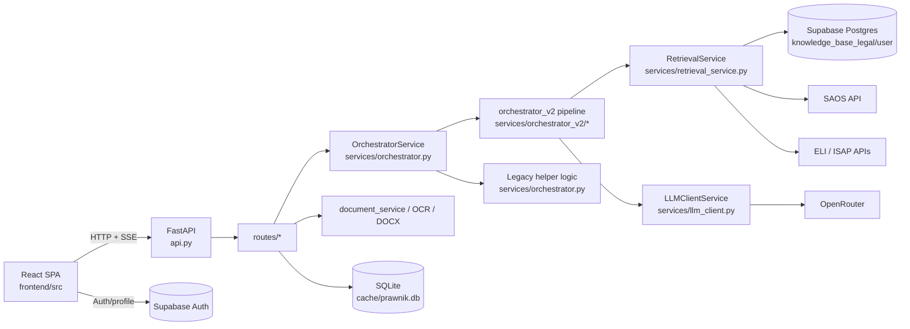

# LexMind (moj prawnik) - Code Wiki

This document reflects the current repository state and explains the active application architecture, major modules, important symbols, dependency relationships, and local run instructions.

## 1. Executive Summary

LexMind is a web-first LegalTech application for Polish legal analysis and drafting. The active product is composed of:

- a FastAPI backend in the repository root,
- a React 19 + Vite frontend in `frontend/`,
- Supabase as the primary hosted persistence/search platform,
- OpenRouter-hosted LLMs for chat, debate, synthesis, OCR, and drafting,
- external legal data integrations with SAOS and ELI/ISAP.

The repository also contains mobile wrappers (`frontend/android`, `frontend/ios`) and historical packaged binaries (`mobile_apps/`), but the primary development flow is the web stack.

Default local URLs:

- Frontend: `http://localhost:3000`
- Backend: `http://127.0.0.1:8003`

## 2. Architecture At A Glance

### 2.1 Runtime topology



### 2.2 Architectural layers

| Layer | Main files | Responsibility |
| --- | --- | --- |
| App bootstrap | `api.py`, `config.py`, `database.py` | Creates the API, loads settings, initializes SQLite, applies middleware |
| HTTP routes | `routes/*.py` | Defines endpoints for chat, documents, health, models, judgments, admin, trial room |
| Orchestration | `services/orchestrator.py`, `services/orchestrator_v2/*` | Converts a user request into retrieval, expert debate, and final synthesis |
| Retrieval and evidence | `services/retrieval_service.py`, `services/rerank_service.py`, `services/citation_guard.py` | Collects legal context, reranks it, and verifies citations |
| Document processing | `services/document_service.py`, `services/vision_ocr.py`, `services/docx_export.py` | Extracts text, indexes it, exports drafts |
| Frontend shell | `frontend/src/main.tsx`, `frontend/src/App.tsx` | Boots the SPA, auth flow, navigation, lazy feature loading |
| Frontend state and transport | `frontend/src/store/*`, `frontend/src/hooks/*`, `frontend/src/services/*` | Stores UI and prompt state, builds chat payloads, consumes SSE |
| External integration | `supabase/*`, `moa/*` | Supabase migrations/edge functions and model-provider helpers |

## 3. Repository Map

### 3.1 Top-level directories

| Path | Purpose |
| --- | --- |
| `api.py` | Main FastAPI entrypoint |
| `config.py` | Central Pydantic settings and feature flags |
| `database.py` | Local encrypted SQLite session/message/profile storage |
| `routes/` | All FastAPI routers |
| `services/` | Core business logic and orchestration |
| `domain/prompts/` | Structured prompt message builder |
| `models/` | Request/response models for selected endpoints |
| `moa/` | OpenRouter client config, prompt presets, retrieval helpers |
| `frontend/` | React/Vite SPA plus Capacitor wrappers |
| `supabase/` | SQL migrations and edge functions |
| `docs/` | Architecture, ops, and design documentation |
| `pdfs/` | Local uploaded files and OCR cache |
| `isap_top1000/`, `lexmind_acts/` | Legal corpora / manifests used by retrieval workflows |
| `scripts/` | Windows startup and maintenance scripts |
| `mobile_apps/` | Historical packaged desktop/mobile binaries |

### 3.2 Backend structure

| Path | Purpose |
| --- | --- |
| `routes/chat_v2.py` | SSE chat controller and payload normalization |
| `routes/documents.py` | Upload, indexing, drafting, DOCX export, document listing |
| `routes/models.py` | Model catalog, health checks, custom model operations |
| `routes/health.py` | OpenRouter balance and hybrid-search health |
| `routes/judgments.py` | SAOS search and facet endpoints |
| `routes/admin.py` | Admin auth, stats, user management |
| `services/orchestrator.py` | Legacy/full orchestration service and shared helpers |
| `services/orchestrator_v2/` | New modular pipeline used by current `/chat` route |
| `services/retrieval_service.py` | Supabase hybrid/vector search plus SAOS/ELI fetchers |
| `services/document_service.py` | Chunking, embeddings, and Supabase indexing |
| `services/llm_client.py` | Retry/fallback wrapper around chat completion APIs |
| `services/citation_guard.py` | Citation extraction and hallucination detection |
| `services/trial_room_service.py` | Trial-room generation pipeline |

### 3.3 Frontend structure

| Path | Purpose |
| --- | --- |
| `frontend/src/main.tsx` | React bootstrap and React Query setup |
| `frontend/src/App.tsx` | App shell, auth lifecycle, tab routing, lazy loading |
| `frontend/src/components/Chat/` | Main chat experience and streamed answer UI |
| `frontend/src/components/Drafter/` | Legal drafting workspace |
| `frontend/src/components/Documents/` | Document upload and library interactions |
| `frontend/src/components/Knowledge/` | Knowledge base management |
| `frontend/src/components/Judgments/` | SAOS search experience |
| `frontend/src/components/Admin/` | Admin dashboard |
| `frontend/src/components/TrialRoom/` | Trial simulation experience |
| `frontend/src/store/` | Zustand app, chat settings, and trial stores |
| `frontend/src/hooks/` | Chat transport, data fetching, model health, trial streaming |
| `frontend/src/services/chatPayloadFactory.ts` | Backend chat payload builder |
| `frontend/src/utils/consumeChatSSE.ts` | Shared SSE stream consumer |
| `frontend/src/utils/supabaseClient.ts` | Supabase client and auth/profile helpers |

## 4. Request Flows

### 4.1 Chat flow

The main interactive flow is:

1. The frontend collects prompt settings, model choices, history, and attachments.
2. `buildChatPayload()` converts UI state into a backend-compatible chat contract.
3. `useChatMutation()` posts the payload to `POST /chat`.
4. `routes/chat_v2.py` normalizes the payload with `LegacyPayloadAdapter`.
5. `OrchestratorService.process_user_request_stream_v2()` converts legacy kwargs into typed parameters.
6. `services/orchestrator_v2/pipeline.py` runs:
   - context building,
   - expert debate,
   - streamed synthesis.
7. `useChatMutation()` consumes SSE chunks and metadata and updates the UI live.
8. The backend persists the final exchange best-effort through helper/database utilities.

### 4.2 Document upload and indexing flow

1. Frontend uploads a file to `POST /documents/upload-document`.
2. `routes/documents.py` saves the file under `pdfs/`.
3. The route extracts text based on file type:
   - PDF via `pypdf`,
   - DOCX via `python-docx`,
   - TXT via UTF-8 decoding,
   - images via `services/vision_ocr.py`.
4. A background task calls `index_document_to_supabase()`.
5. `services/document_service.py` chunks the text, computes embeddings, and writes records to Supabase.

### 4.3 Model health flow

1. Frontend calls `GET /health/free-models` before sending chat.
2. `routes/health.py` pings configured fallback models with very small prompts.
3. The frontend stores latency data in `useChatSettingsStore`.
4. The latency map is sent back with the chat payload for model-aware orchestration and UI hints.

## 5. Backend Architecture

### 5.1 Bootstrap and configuration

#### `api.py`

Responsibilities:

- creates the `FastAPI` app,
- enables localhost/LAN CORS,
- applies a localhost-only guard middleware,
- registers all feature routers,
- initializes SQLite on startup,
- exposes a lightweight `GET /health`.

Important symbols:

- `app`: the application object
- `host_validation_middleware()`: rejects non-local traffic
- `startup_event()`: calls `database.init_db()`
- `health_check()`: basic health endpoint

#### `config.py`

Responsibilities:

- defines all runtime feature flags through `Settings`,
- loads `.env`,
- centralizes model defaults, retrieval limits, OCR, synthesis, security, trial-room, and timeout settings.

Important symbols:

- `Settings`
- `settings`
- `DEFAULT_MODELS`
- `FALLBACK_MODELS`
- `DEPRECATED_MODEL_ALIASES`

Configuration convention:

- core settings use `LEXMIND_` environment variables,
- some integration keys still use non-prefixed names such as `OPENROUTER_API_KEY`, `SUPABASE_URL`, and `SUPABASE_ANON_KEY`.

#### `database.py`

Responsibilities:

- manages the local SQLite file at `cache/prawnik.db`,
- encrypts stored message/state content before saving,
- stores sessions, messages, settings, profiles, and investigation state,
- performs lightweight schema migration on startup.

Important symbols:

- `get_encryption_key()`
- `encrypt_text()`
- `decrypt_text()`
- `get_db()`
- `init_db()`
- `save_message()`
- `get_messages()`
- `save_session_investigation_state()`

### 5.2 Routes and controllers

| Route module | Key endpoints | Responsibility |
| --- | --- | --- |
| `routes/chat_v2.py` | `POST /chat` | Main SSE chat entrypoint |
| `routes/documents.py` | `/documents/upload-document`, `/documents/export-docx`, `/documents/draft-document` | Document ingestion and drafting |
| `routes/models.py` | `/models`, `/models/ping`, `/models/ping-bulk`, `/models/presets` | LLM catalog and health |
| `routes/health.py` | `/health/balance`, `/health/hybrid-search`, `/health/free-models` | Integration health and ping helpers |
| `routes/judgments.py` | `/judgments/search`, facets endpoints | SAOS judgment discovery |
| `routes/admin.py` | `/admin/stats`, `/admin/users` | Admin-only management |
| `routes/database.py` | session/message data endpoints | Local chat persistence API |
| `routes/trial_room.py` | trial position/hearing/verdict | Trial-room generation |
| `routes/core.py` | prompt preset/config endpoints | Shared UI configuration |
| `routes/analytics.py` | analytics endpoints | Usage/telemetry-style outputs |

### 5.3 Chat controller details

`routes/chat_v2.py` is the main controller for AI answers.

Key responsibilities:

- accepts a permissive `ChatRequest` model,
- normalizes legacy and new payload variants,
- derives fallback text from chat history when the message is empty,
- streams metadata, content chunks, and final metadata in SSE format,
- saves the final exchange after streaming completes.

Key symbols:

- `ChatRequest`
- `chat_endpoint()`
- `_extract_last_user_message_text()`

### 5.4 Orchestration model

The repository currently contains two orchestration styles:

- the current request path uses `process_user_request_stream_v2()` and `services/orchestrator_v2/*`,
- `services/orchestrator.py` still contains a large legacy/full pipeline with many shared helpers and more advanced stage-specific logic.

This means the codebase is in a partial refactor state rather than a clean old/new split.

#### `services/orchestrator.py`

Responsibilities:

- exposes the singleton `orchestrator`,
- converts incoming kwargs to typed `OrchestratorInputParams`,
- resolves models and prompt catalogs,
- owns shared helper logic for prompt building, history formatting, RODO masking, citation handling, and legacy staged execution.

Important symbols:

- `OrchestratorService`
- `process_user_request_stream_v2()`
- `process_user_request_stream()`
- `_resolve_model_id()`
- `_format_chat_history()`
- `_build_expert_prompt()`
- `_resolve_expert_role_block()`

#### `services/orchestrator_v2/pipeline.py`

Responsibilities:

- coordinates the modular V2 flow,
- instantiates dedicated stage objects,
- streams stage metadata and final output.

Important symbols:

- `OrchestrationPipeline`
- `execute()`

#### `services/orchestrator_v2/context_builder.py`

Responsibilities:

- processes attachments and chat history,
- masks private data,
- fetches user knowledge,
- creates a case brief,
- gathers legal intelligence from RAG, SAOS, and ELI,
- compiles a single investigation context string.

Important symbols:

- `InvestigationContext`
- `LegalContextBuilder`
- `build_context()`
- `_gather_user_knowledge()`
- `_gather_legal_intelligence()`
- `_compile_investigation_context()`

#### `services/orchestrator_v2/briefing_engine.py`

Responsibilities:

- turns raw materials into a structured case brief,
- extracts specific statutory citations,
- protects downstream legal search from noisy keywords.

Important symbols:

- `CaseBrief`
- `BriefingEngine`
- `generate_brief()`

#### `services/orchestrator_v2/debate_engine.py`

Responsibilities:

- resolves expert prompts,
- runs expert models in parallel,
- collects expert opinions and latency metrics.

Important symbols:

- `DebateResult`
- `DebateEngine`
- `run_debate()`
- `_run_single_expert()`

#### `services/orchestrator_v2/synthesis_engine.py`

Responsibilities:

- verifies citation hallucinations before final answer generation,
- builds the final "senior advocate" synthesis prompt,
- streams the final answer back to the route.

Important symbols:

- `SeniorAdvocateSynthesis`
- `synthesize_stream()`
- `_verify_hallucinations()`

### 5.5 Retrieval and evidence pipeline

#### `services/retrieval_service.py`

Responsibilities:

- executes Supabase vector and hybrid RPC search,
- provides HTTP fallbacks when hybrid RPC is unavailable,
- queries SAOS and ELI/ISAP,
- caches retrieval results,
- tracks circuit-breaker state for unstable external systems.

Important symbols:

- `RetrievalService`
- `PostgresHybridSearch`
- `search_supabase()`
- `search_saos()`
- `search_eli()`
- `execute_hybrid_query()`

Key design choices:

- hybrid RAG prefers Supabase RPC functions such as `hybrid_search_legal_v2`,
- falls back to older RPC names and then to pure vector search,
- deduplicates and reranks multi-query results,
- hardens string handling because upstream legal APIs can return mixed data types.

#### Related support modules

| Module | Responsibility |
| --- | --- |
| `services/rerank_service.py` | Reranks legal chunks and external results |
| `services/citation_guard.py` | Extracts and audits citations against context |
| `services/legal_basis_validator.py` | Validates references to concrete legal bases |
| `services/context_packer.py` | Packs multiple evidence sources into model-ready blocks |
| `services/confidence_scoring.py` | Computes a confidence metric from retrieval and citation quality |
| `services/circuit_breaker.py` | Prevents repeated failures against flaky external integrations |
| `services/rag_cache.py` | In-memory retrieval response cache |

### 5.6 Document and drafting services

| Module | Responsibility |
| --- | --- |
| `services/document_service.py` | Chunking, embedding, deduplication, and Supabase indexing |
| `services/vision_ocr.py` | OCR for image uploads via multimodal LLMs |
| `services/ocr_cache.py` | Reuses OCR results for identical images |
| `services/docx_export.py` | Markdown-to-DOCX export |
| `services/docx_template_export.py` | Structured DOCX rendering when template data is available |
| `services/draft_document_catalog.py` | Maps document types to drafting hints |

### 5.7 Trial room

The trial-room feature is optional and enabled by `settings.trial_enabled`.

Main modules:

- `routes/trial_room.py`
- `services/trial_room_service.py`
- `services/trial_position_pipeline.py`
- `services/trial_context.py`

Purpose:

- generate side-specific litigation positions,
- simulate hearing rounds,
- produce a judge-style verdict,
- reuse chat and retrieval context in a different UX flow.

## 6. Frontend Architecture

### 6.1 Bootstrapping and shell

#### `frontend/src/main.tsx`

Responsibilities:

- runs `pruneOversizedPersistedState()` before boot,
- computes a density mode for responsive rendering,
- initializes React Query,
- mounts `<App />`.

#### `frontend/src/App.tsx`

Responsibilities:

- controls app phases (`splash`, `landing`, `portal`, `wait-auth`, `app`),
- initializes Supabase auth listeners,
- fetches the user role,
- lazy-loads each major feature view,
- renders desktop and mobile navigation,
- wraps the main app in `ChatProvider`.

Important UI domains:

- splash/landing/portal auth entry flow,
- authenticated workspace with tabs for chat, trial room, drafter, judgments, documents, prompts, knowledge, settings, and admin.

### 6.2 State management

#### `frontend/src/store/useAppStore.ts`

Purpose:

- global shell state:
  - active tab,
  - Supabase session,
  - auth loading,
  - user role,
  - app phase,
  - fullscreen mode.

#### `frontend/src/store/useChatSettingsStore.ts`

Purpose:

- persistent chat orchestration state:
  - single vs consensus vs MOA mode,
  - response mode (`citizen`, `strategic`, `draft`),
  - selected single model / experts / judge,
  - favorite models and active models,
  - prompt preset, role, and task catalogs,
  - toggles for SAOS, ELI, legal RAG, and user RAG,
  - model latency map and speed optimization helpers.

This store is the main frontend representation of the backend chat contract.

### 6.3 Chat transport

#### `frontend/src/services/chatPayloadFactory.ts`

Responsibilities:

- reads current prompt and model state from `useChatSettingsStore`,
- converts UI choices into the `ChatPayloadV2`/legacy-compatible backend payload,
- adds selected models, judge, role prompts, and retrieval toggles.

Important symbol:

- `buildChatPayload()`

#### `frontend/src/hooks/useChatMutation.ts`

Responsibilities:

- performs a preflight model-health check,
- builds the chat payload,
- sends `POST /chat`,
- consumes streaming SSE,
- exposes cancellation through `AbortController`,
- returns final content plus rich metadata.

Important symbols:

- `useChatMutation()`
- `normalizeUrgencyAlerts()`

#### `frontend/src/utils/consumeChatSSE.ts`

Purpose:

- parses SSE frames from both chat and trial-room streams,
- invokes callbacks for content chunks and metadata.

### 6.4 Frontend feature modules

| Module | Responsibility |
| --- | --- |
| `components/Chat/` | Main legal assistant workspace |
| `components/Drafter/` | Structured legal drafting and document export |
| `components/Documents/` | Upload and list documents |
| `components/Knowledge/` | Browse and manage legal/user knowledge base |
| `components/Judgments/` | Search judgments via SAOS |
| `components/Prompts/` | Prompt preset configuration |
| `components/Settings/` | Profile, subscription, API/config settings |
| `components/Admin/` | Admin panels for users, system status, models, security |
| `components/TrialRoom/` | Trial simulation UI |
| `components/Landing/` | Marketing/entry pages |

## 7. Key Classes And Functions

This section highlights the symbols that matter most when navigating the codebase.

### 7.1 Backend symbols

| Symbol | File | What it does |
| --- | --- | --- |
| `Settings` | `config.py` | Central feature-flag and runtime configuration model |
| `host_validation_middleware()` | `api.py` | Blocks non-local requests unless they are from localhost/LAN |
| `ChatRequest` | `routes/chat_v2.py` | Permissive request contract for chat requests |
| `chat_endpoint()` | `routes/chat_v2.py` | Main SSE controller for AI responses |
| `OrchestratorService` | `services/orchestrator.py` | Main backend orchestration facade |
| `process_user_request_stream_v2()` | `services/orchestrator.py` | Current bridge into the modular V2 pipeline |
| `OrchestrationPipeline.execute()` | `services/orchestrator_v2/pipeline.py` | Runs context building, debate, and synthesis |
| `LegalContextBuilder.build_context()` | `services/orchestrator_v2/context_builder.py` | Aggregates evidence and prepares the research context |
| `BriefingEngine.generate_brief()` | `services/orchestrator_v2/briefing_engine.py` | Produces a structured case brief |
| `DebateEngine.run_debate()` | `services/orchestrator_v2/debate_engine.py` | Launches expert-model analysis in parallel |
| `SeniorAdvocateSynthesis.synthesize_stream()` | `services/orchestrator_v2/synthesis_engine.py` | Streams the final answer |
| `RetrievalService.search_supabase()` | `services/retrieval_service.py` | Searches Supabase legal or user knowledge bases |
| `RetrievalService.search_saos()` | `services/retrieval_service.py` | Fetches matching judgments from SAOS |
| `RetrievalService.search_eli()` | `services/retrieval_service.py` | Fetches matching acts from ELI/ISAP |
| `upload_document()` | `routes/documents.py` | Extracts text and schedules indexing |
| `index_document_to_rag()` | `routes/documents.py` | Direct document indexing endpoint |
| `draft_document()` | `routes/documents.py` | Generates a legal draft document |
| `export_docx()` | `routes/documents.py` | Converts generated content into DOCX |
| `init_db()` | `database.py` | Initializes and migrates SQLite tables |

### 7.2 Frontend symbols

| Symbol | File | What it does |
| --- | --- | --- |
| `App` | `frontend/src/App.tsx` | App shell and navigation coordinator |
| `useAppStore` | `frontend/src/store/useAppStore.ts` | Global shell/session state |
| `useChatSettingsStore` | `frontend/src/store/useChatSettingsStore.ts` | Persistent orchestration and prompt state |
| `buildChatPayload()` | `frontend/src/services/chatPayloadFactory.ts` | Maps UI state to backend request payload |
| `useChatMutation()` | `frontend/src/hooks/useChatMutation.ts` | Sends chat requests and consumes SSE |
| `consumeChatSSE()` | `frontend/src/utils/consumeChatSSE.ts` | Low-level SSE parser |
| `useKnowledgeBase()` | `frontend/src/hooks/index.ts` | React Query hook for legal knowledge base actions |
| `useUserLibrary()` | `frontend/src/hooks/index.ts` | React Query hook for the user document library |
| `useTrialStream()` | `frontend/src/hooks/useTrialStream.ts` | Trial-room streaming client |

## 8. Dependency Relationships

### 8.1 Core dependency graph

```mermaid
flowchart TD
  A[frontend/src/App.tsx] --> B[useChatMutation]
  B --> C[buildChatPayload]
  B --> D[/chat SSE]
  D --> E[routes/chat_v2.py]
  E --> F[LegacyPayloadAdapter]
  E --> G[OrchestratorService.process_user_request_stream_v2]
  G --> H[orchestrator_v2/pipeline.py]
  H --> I[context_builder.py]
  H --> J[debate_engine.py]
  H --> K[synthesis_engine.py]
  I --> L[RetrievalService]
  J --> M[LLMClientService]
  K --> M
  L --> N[Supabase RPC]
  L --> O[SAOS]
  L --> P[ELI/ISAP]
```

### 8.2 Practical coupling notes

- `routes/chat_v2.py` depends on `schemas/chat_legacy_adapter.py` so the backend can accept both old and new payload shapes.
- `services/orchestrator_v2/context_builder.py` depends on `services/orchestrator.py` for legacy helper methods such as chat-history formatting.
- `services/orchestrator_v2/debate_engine.py` and `services/orchestrator_v2/synthesis_engine.py` both depend on `services/llm_client.py`, which centralizes retries and fallback models.
- `services/retrieval_service.py` depends on `services/indexing_service.py` to embed queries before Supabase RPC calls.
- `routes/documents.py` depends on `services/document_service.py`, which in turn depends on Supabase and embedding services.
- `frontend/src/services/chatPayloadFactory.ts` depends directly on `useChatSettingsStore`, so the UI state model effectively defines the backend request shape.

### 8.3 Storage relationships

| Storage | Used by | Purpose |
| --- | --- | --- |
| SQLite (`cache/prawnik.db`) | `database.py`, admin/session routes | Local sessions, encrypted messages, settings, profiles |
| Supabase Auth | frontend auth flow, admin validation | User authentication and roles |
| Supabase Postgres / RPC | retrieval and indexing services | User/legal knowledge base storage and hybrid search |
| Local `pdfs/` folder | document routes | Saved uploaded files and OCR cache |
| Zustand persisted storage | frontend stores | Remembers model/prompt settings across reloads |

## 9. External Integrations

### 9.1 OpenRouter

Used for:

- chat completions,
- expert debate,
- synthesis,
- model health pings,
- image OCR,
- some drafting flows.

Relevant files:

- `services/llm_client.py`
- `moa/http_client.py`
- `routes/models.py`
- `routes/health.py`

### 9.2 Supabase

Used for:

- auth and profile data,
- knowledge-base storage,
- hybrid/vector retrieval RPC functions,
- edge functions stored under `supabase/functions/`,
- migrations stored under `supabase/migrations/`.

Important migration theme:

- hybrid search deployment and fallback RPC functions.

### 9.3 SAOS and ELI/ISAP

Used for:

- case-law retrieval,
- statutory act lookup,
- enriching the legal context before final synthesis.

Relevant files:

- `services/retrieval_service.py`
- `routes/judgments.py`
- `moa/saos.py`

## 10. Running The Project

### 10.1 Prerequisites

- Python 3.10+
- Node.js 18+
- npm
- Supabase project with required tables/RPC functions
- OpenRouter API key

There is no Docker or Compose setup in this repository.

### 10.2 Required environment variables

Create `.env` in the repository root:

```env
OPENROUTER_API_KEY=your_openrouter_key
SUPABASE_URL=https://your-project.supabase.co
SUPABASE_ANON_KEY=your_publishable_key
```

Common optional variables:

```env
GOOGLE_API_KEY=your_google_key
SUPABASE_SERVICE_ROLE_KEY=your_service_role_key
COHERE_API_KEY=your_cohere_key
LEXMIND_RERANK_PROVIDER=heuristic
LEXMIND_FEATURE_FAST_STATUTORY_PATH=true
LEXMIND_DEBATE_ON_SINGLE=false
```

Reference files:

- `.env.example`
- `docs/ENV_FLAGS.md`

### 10.3 Install dependencies

Recommended Windows path:

```bat
copy .env.example .env
install.bat
```

Manual equivalent:

```bat
python -m venv .venv
.venv\Scripts\activate
pip install -r requirements.txt
cd frontend
npm install --legacy-peer-deps
cd ..
```

### 10.4 Start the application

Recommended launcher:

```bat
uruchom.bat
```

What it does:

- loads environment values from the root `.env`,
- starts FastAPI on port `8003`,
- starts Vite on port `3000`,
- waits for both processes to be ready,
- opens the browser automatically.

Manual run:

Backend:

```bat
.venv\Scripts\activate
python -m uvicorn api:app --host 127.0.0.1 --port 8003 --reload
```

Frontend:

```bat
cd frontend
npm run dev -- --port 3000 --strictPort
```

### 10.5 Verification

Check these URLs after startup:

- `http://127.0.0.1:8003/health`
- `http://127.0.0.1:8003/health/hybrid-search`
- `http://127.0.0.1:8003/health/balance`
- `http://localhost:3000`

### 10.6 Known operational constraints

- The backend intentionally blocks non-localhost/LAN traffic by default.
- The frontend reads Supabase values from the root `.env` through `frontend/vite.config.ts`.
- Hybrid search depends on Supabase RPC functions; if health checks fail, run the SQL migrations in `supabase/migrations/`.
- `requirements.txt` is broad and includes heavy OCR/ML packages; first-time installation may be slow.

## 11. Maintenance Notes

### 11.1 Signs of an in-progress refactor

The repository shows both:

- a new clean V2 pipeline under `services/orchestrator_v2/`,
- a much larger legacy orchestration path in `services/orchestrator.py`.

Implication:

- new contributors should inspect both locations before changing orchestration behavior,
- some helpers remain owned by the legacy service even when the V2 pipeline is used,
- documentation and tests should be updated carefully whenever orchestration logic moves.

### 11.2 Historical and secondary assets

These are present but not part of the main local runtime:

- `frontend/android/` and `frontend/ios/`: Capacitor wrappers around the web app
- `mobile_apps/`: packaged binaries and installation notes
- `supabase/functions/`: alternative edge-function runtime paths

## 12. Suggested Reading Order For New Contributors

If you are new to the repository, read the code in this order:

1. `README.md`
2. `api.py`
3. `config.py`
4. `routes/chat_v2.py`
5. `services/orchestrator.py`
6. `services/orchestrator_v2/pipeline.py`
7. `services/orchestrator_v2/context_builder.py`
8. `services/retrieval_service.py`
9. `routes/documents.py`
10. `frontend/src/main.tsx`
11. `frontend/src/App.tsx`
12. `frontend/src/hooks/useChatMutation.ts`
13. `frontend/src/services/chatPayloadFactory.ts`

That path gives the fastest understanding of how UI state becomes a streamed legal answer.
