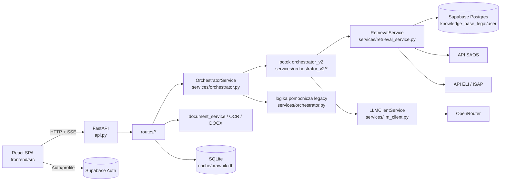

# LexMind (moj prawnik) - Wiki kodu

Ten dokument odzwierciedla aktualny stan repozytorium i opisuje aktywną architekturę aplikacji, główne moduły, istotne symbole, zależności oraz sposób lokalnego uruchamiania projektu.

## 1. Streszczenie projektu

LexMind to webowy system LegalTech do analizy i draftingu prawniczego dla prawa polskiego. Aktywny produkt składa się z:

- backendu FastAPI w katalogu głównym repozytorium,
- frontendu React 19 + Vite w `frontend/`,
- Supabase jako głównej warstwy hostowanej persystencji i wyszukiwania,
- modeli LLM przez OpenRouter do czatu, debaty ekspertów, syntezy, OCR i draftingu,
- integracji z zewnętrznymi źródłami prawnymi: SAOS oraz ELI/ISAP.

Repozytorium zawiera też wrappery mobilne (`frontend/android`, `frontend/ios`) i historyczne paczki binarne (`mobile_apps/`), ale podstawowy przepływ developerski dotyczy stosu webowego.

Domyślne lokalne adresy:

- Frontend: `http://localhost:3000`
- Backend: `http://127.0.0.1:8003`

## 2. Architektura w skrócie

### 2.1 Topologia runtime



### 2.2 Warstwy architektoniczne

| Warstwa | Główne pliki | Odpowiedzialność |
| --- | --- | --- |
| Bootstrap aplikacji | `api.py`, `config.py`, `database.py` | Tworzy API, ładuje ustawienia, inicjalizuje SQLite, nakłada middleware |
| Trasy HTTP | `routes/*.py` | Definiuje endpointy dla czatu, dokumentów, health, modeli, orzeczeń, admina i sali rozpraw |
| Orkiestracja | `services/orchestrator.py`, `services/orchestrator_v2/*` | Zamienia żądanie użytkownika w retrieval, debatę ekspertów i końcową syntezę |
| Retrieval i dowody | `services/retrieval_service.py`, `services/rerank_service.py`, `services/citation_guard.py` | Zbiera kontekst prawny, rerankuje go i weryfikuje cytowania |
| Przetwarzanie dokumentów | `services/document_service.py`, `services/vision_ocr.py`, `services/docx_export.py` | Ekstrahuje tekst, indeksuje go i eksportuje drafty |
| Shell frontendu | `frontend/src/main.tsx`, `frontend/src/App.tsx` | Uruchamia SPA, obsługuje auth, nawigację i lazy loading |
| Stan i transport frontendu | `frontend/src/store/*`, `frontend/src/hooks/*`, `frontend/src/services/*` | Przechowuje stan UI i promptów, buduje payload czatu, konsumuje SSE |
| Integracje zewnętrzne | `supabase/*`, `moa/*` | Migracje/Edge Functions Supabase oraz helpery do providerów modeli |

## 3. Mapa repozytorium

### 3.1 Najważniejsze katalogi najwyższego poziomu

| Ścieżka | Przeznaczenie |
| --- | --- |
| `api.py` | Główny punkt wejścia FastAPI |
| `config.py` | Centralne ustawienia Pydantic i feature flagi |
| `database.py` | Lokalny, szyfrowany magazyn SQLite dla sesji/wiadomości/profili |
| `routes/` | Wszystkie routery FastAPI |
| `services/` | Główna logika biznesowa i orkiestracja |
| `domain/prompts/` | Strukturalny builder wiadomości promptów |
| `models/` | Modele request/response dla wybranych endpointów |
| `moa/` | Konfiguracja klienta OpenRouter, presety promptów, helpery retrievalu |
| `frontend/` | SPA React/Vite wraz z wrapperami Capacitor |
| `supabase/` | Migracje SQL i edge functions |
| `docs/` | Dokumentacja architektury, operacyjna i produktowa |
| `pdfs/` | Lokalny magazyn uploadów i cache OCR |
| `isap_top1000/`, `lexmind_acts/` | Korpusy prawne / manifesty używane przez retrieval |
| `scripts/` | Skrypty startowe i utrzymaniowe dla Windows |
| `mobile_apps/` | Historyczne binarki desktop/mobile |

### 3.2 Struktura backendu

| Ścieżka | Przeznaczenie |
| --- | --- |
| `routes/chat_v2.py` | Kontroler SSE dla czatu i normalizacja payloadu |
| `routes/documents.py` | Upload, indeksowanie, drafting, eksport DOCX, listing dokumentów |
| `routes/models.py` | Katalog modeli, health checki, operacje na modelach |
| `routes/health.py` | OpenRouter balance i health hybrydowego wyszukiwania |
| `routes/judgments.py` | Wyszukiwanie SAOS i endpointy słownikowe |
| `routes/admin.py` | Auth admina, statystyki, zarządzanie użytkownikami |
| `services/orchestrator.py` | Główna usługa orkiestracji legacy/full i helpery współdzielone |
| `services/orchestrator_v2/` | Nowy modularny potok używany przez bieżące `/chat` |
| `services/retrieval_service.py` | Wyszukiwanie hybrydowe/wektorowe w Supabase oraz fetchery SAOS/ELI |
| `services/document_service.py` | Chunkowanie, embeddingi i indeksowanie w Supabase |
| `services/llm_client.py` | Retry/fallback dla wywołań modeli |
| `services/citation_guard.py` | Ekstrakcja i detekcja halucynacji cytowań |
| `services/trial_room_service.py` | Pipeline sali rozpraw |

### 3.3 Struktura frontendu

| Ścieżka | Przeznaczenie |
| --- | --- |
| `frontend/src/main.tsx` | Bootstrap React i konfiguracja React Query |
| `frontend/src/App.tsx` | Shell aplikacji, auth lifecycle, routing zakładek, lazy loading |
| `frontend/src/components/Chat/` | Główny interfejs czatu i renderowanie odpowiedzi streamowanych |
| `frontend/src/components/Drafter/` | Workspace do draftingu pism |
| `frontend/src/components/Documents/` | Upload dokumentów i operacje biblioteczne |
| `frontend/src/components/Knowledge/` | Zarządzanie bazą wiedzy |
| `frontend/src/components/Judgments/` | Interfejs wyszukiwania SAOS |
| `frontend/src/components/Admin/` | Panel administratora |
| `frontend/src/components/TrialRoom/` | Symulacja sali rozpraw |
| `frontend/src/store/` | Store'y Zustand dla aplikacji, czatu i trial room |
| `frontend/src/hooks/` | Transport czatu, fetching danych, health modeli, streaming trial |
| `frontend/src/services/chatPayloadFactory.ts` | Builder payloadu czatu do backendu |
| `frontend/src/utils/consumeChatSSE.ts` | Wspólny konsument strumieni SSE |
| `frontend/src/utils/supabaseClient.ts` | Klient Supabase i helpery auth/profili |

## 4. Główne przepływy żądań

### 4.1 Przepływ czatu

Podstawowy przepływ wygląda tak:

1. Frontend zbiera ustawienia promptów, wybór modeli, historię i załączniki.
2. `buildChatPayload()` zamienia stan UI na kontrakt żądania zgodny z backendem.
3. `useChatMutation()` wysyła payload do `POST /chat`.
4. `routes/chat_v2.py` normalizuje payload przez `LegacyPayloadAdapter`.
5. `OrchestratorService.process_user_request_stream_v2()` zamienia legacy kwargs na typowane parametry.
6. `services/orchestrator_v2/pipeline.py` uruchamia:
   - budowanie kontekstu,
   - debatę ekspertów,
   - streamowaną syntezę.
7. `useChatMutation()` konsumuje chunki SSE i metadane oraz aktualizuje UI na żywo.
8. Backend zapisuje końcową wymianę best-effort przez helpery/bazę.

### 4.2 Przepływ uploadu i indeksowania dokumentu

1. Frontend wysyła plik do `POST /documents/upload-document`.
2. `routes/documents.py` zapisuje plik w `pdfs/`.
3. Trasa ekstrahuje tekst zależnie od typu pliku:
   - PDF przez `pypdf`,
   - DOCX przez `python-docx`,
   - TXT przez dekodowanie UTF-8,
   - obrazy przez `services/vision_ocr.py`.
4. Zadanie w tle wywołuje `index_document_to_supabase()`.
5. `services/document_service.py` chunkuje tekst, liczy embeddingi i zapisuje rekordy do Supabase.

### 4.3 Przepływ health check modeli

1. Frontend wywołuje `GET /health/free-models` przed wysłaniem czatu.
2. `routes/health.py` pinguje skonfigurowane modele fallback bardzo krótkimi promptami.
3. Frontend zapisuje dane o opóźnieniach w `useChatSettingsStore`.
4. Mapa opóźnień jest odsyłana w payloadzie czatu jako wsparcie dla orkiestracji i UI.

## 5. Architektura backendu

### 5.1 Bootstrap i konfiguracja

#### `api.py`

Odpowiedzialności:

- tworzy aplikację `FastAPI`,
- włącza CORS dla localhost/LAN,
- nakłada middleware blokujący ruch spoza localhost/LAN,
- rejestruje wszystkie routery funkcjonalne,
- inicjalizuje SQLite przy starcie,
- wystawia lekkie `GET /health`.

Istotne symbole:

- `app`: obiekt aplikacji,
- `host_validation_middleware()`: odrzuca ruch spoza zaufanych hostów,
- `startup_event()`: wywołuje `database.init_db()`,
- `health_check()`: bazowy endpoint health.

#### `config.py`

Odpowiedzialności:

- definiuje wszystkie feature flagi runtime przez `Settings`,
- ładuje `.env`,
- centralizuje domyślne modele, limity retrievalu, OCR, syntezę, security, trial room i timeouty.

Istotne symbole:

- `Settings`
- `settings`
- `DEFAULT_MODELS`
- `FALLBACK_MODELS`
- `DEPRECATED_MODEL_ALIASES`

Konwencja konfiguracji:

- ustawienia rdzenia używają zmiennych środowiskowych `LEXMIND_`,
- część kluczy integracyjnych nadal używa nazw bez prefiksu, np. `OPENROUTER_API_KEY`, `SUPABASE_URL`, `SUPABASE_ANON_KEY`.

#### `database.py`

Odpowiedzialności:

- zarządza lokalną bazą SQLite w `cache/prawnik.db`,
- szyfruje zawartość wiadomości i stanów przed zapisem,
- przechowuje sesje, wiadomości, ustawienia, profile i stan investigation,
- wykonuje lekkie migracje schematu przy starcie.

Istotne symbole:

- `get_encryption_key()`
- `encrypt_text()`
- `decrypt_text()`
- `get_db()`
- `init_db()`
- `save_message()`
- `get_messages()`
- `save_session_investigation_state()`

### 5.2 Trasy i kontrolery

| Moduł trasy | Kluczowe endpointy | Odpowiedzialność |
| --- | --- | --- |
| `routes/chat_v2.py` | `POST /chat` | Główne wejście SSE dla czatu |
| `routes/documents.py` | `/documents/upload-document`, `/documents/export-docx`, `/documents/draft-document` | Ingest dokumentów i drafting |
| `routes/models.py` | `/models`, `/models/ping`, `/models/ping-bulk`, `/models/presets` | Katalog LLM i health |
| `routes/health.py` | `/health/balance`, `/health/hybrid-search`, `/health/free-models` | Health integracji i ping modeli |
| `routes/judgments.py` | `/judgments/search`, endpointy słownikowe | Odkrywanie orzeczeń SAOS |
| `routes/admin.py` | `/admin/stats`, `/admin/users` | Operacje administracyjne |
| `routes/database.py` | endpointy sesji/wiadomości | API lokalnej persystencji czatu |
| `routes/trial_room.py` | pozycja/hearing/verdict | Generowanie sali rozpraw |
| `routes/core.py` | endpointy presetów/configu promptów | Wspólna konfiguracja dla UI |
| `routes/analytics.py` | endpointy analityczne | Dane telemetryczne/usage |

### 5.3 Szczegóły kontrolera czatu

`routes/chat_v2.py` to główny kontroler odpowiedzi AI.

Kluczowe odpowiedzialności:

- przyjmuje elastyczny model `ChatRequest`,
- normalizuje warianty payloadu legacy i nowe,
- wyprowadza tekst fallback z historii czatu, gdy wiadomość jest pusta,
- streamuje metadane, chunki treści i final metadata w formacie SSE,
- zapisuje końcową wymianę po zakończeniu streamu.

Istotne symbole:

- `ChatRequest`
- `chat_endpoint()`
- `_extract_last_user_message_text()`

### 5.4 Model orkiestracji

Repozytorium zawiera obecnie dwa style orkiestracji:

- aktywna ścieżka requestu używa `process_user_request_stream_v2()` i `services/orchestrator_v2/*`,
- `services/orchestrator.py` nadal zawiera duży, legacy/full pipeline z wieloma helperami i bardziej rozbudowaną logiką etapową.

To oznacza, że kodbase jest w stanie częściowej refaktoryzacji, a nie czystego podziału stary/nowy.

#### `services/orchestrator.py`

Odpowiedzialności:

- wystawia singleton `orchestrator`,
- zamienia przychodzące kwargs na `OrchestratorInputParams`,
- rozwiązuje modele i katalogi promptów,
- posiada współdzieloną logikę pomocniczą dla budowania promptów, formatowania historii, maskowania RODO, obsługi cytowań i legacy etapów.

Istotne symbole:

- `OrchestratorService`
- `process_user_request_stream_v2()`
- `process_user_request_stream()`
- `_resolve_model_id()`
- `_format_chat_history()`
- `_build_expert_prompt()`
- `_resolve_expert_role_block()`

#### `services/orchestrator_v2/pipeline.py`

Odpowiedzialności:

- koordynuje modularny przepływ V2,
- instancjonuje dedykowane obiekty etapów,
- streamuje metadane etapów i wynik końcowy.

Istotne symbole:

- `OrchestrationPipeline`
- `execute()`

#### `services/orchestrator_v2/context_builder.py`

Odpowiedzialności:

- przetwarza załączniki i historię czatu,
- maskuje dane prywatne,
- pobiera wiedzę użytkownika,
- tworzy kartę sprawy,
- zbiera inteligencję prawną z RAG, SAOS i ELI,
- kompiluje jeden wspólny kontekst investigation.

Istotne symbole:

- `InvestigationContext`
- `LegalContextBuilder`
- `build_context()`
- `_gather_user_knowledge()`
- `_gather_legal_intelligence()`
- `_compile_investigation_context()`

#### `services/orchestrator_v2/briefing_engine.py`

Odpowiedzialności:

- zamienia surowe materiały w strukturalną kartę sprawy,
- ekstrahuje konkretne cytaty ustawowe,
- chroni downstream legal search przed zaszumieniem słowami-kluczami.

Istotne symbole:

- `CaseBrief`
- `BriefingEngine`
- `generate_brief()`

#### `services/orchestrator_v2/debate_engine.py`

Odpowiedzialności:

- rozwiązuje prompty ekspertów,
- uruchamia modele eksperckie równolegle,
- zbiera opinie ekspertów i metryki opóźnień.

Istotne symbole:

- `DebateResult`
- `DebateEngine`
- `run_debate()`
- `_run_single_expert()`

#### `services/orchestrator_v2/synthesis_engine.py`

Odpowiedzialności:

- weryfikuje halucynacje cytowań przed wygenerowaniem odpowiedzi końcowej,
- buduje prompt końcowej syntezy „głównego adwokata”,
- streamuje finalną odpowiedź z powrotem do routera.

Istotne symbole:

- `SeniorAdvocateSynthesis`
- `synthesize_stream()`
- `_verify_hallucinations()`

### 5.5 Retrieval i pipeline dowodowy

#### `services/retrieval_service.py`

Odpowiedzialności:

- wykonuje wyszukiwanie wektorowe i hybrydowe RPC w Supabase,
- zapewnia fallback HTTP, gdy hybrydowe RPC jest niedostępne,
- odpytuje SAOS oraz ELI/ISAP,
- cache'uje wyniki retrievalu,
- śledzi stan circuit breakera dla niestabilnych integracji zewnętrznych.

Istotne symbole:

- `RetrievalService`
- `PostgresHybridSearch`
- `search_supabase()`
- `search_saos()`
- `search_eli()`
- `execute_hybrid_query()`

Kluczowe decyzje projektowe:

- hybrydowy RAG preferuje funkcje RPC Supabase takie jak `hybrid_search_legal_v2`,
- fallbackuje do starszych nazw RPC, a następnie do czystego wyszukiwania wektorowego,
- deduplikuje i rerankuje wyniki z wielu zapytań,
- utwardza obsługę stringów, bo zewnętrzne API prawne zwracają czasem mieszane typy danych.

#### Powiązane moduły pomocnicze

| Moduł | Odpowiedzialność |
| --- | --- |
| `services/rerank_service.py` | Reranking chunków prawnych i wyników zewnętrznych |
| `services/citation_guard.py` | Ekstrakcja i audyt cytowań względem kontekstu |
| `services/legal_basis_validator.py` | Walidacja odniesień do konkretnych podstaw prawnych |
| `services/context_packer.py` | Pakowanie wielu źródeł dowodowych do bloków dla modeli |
| `services/confidence_scoring.py` | Liczenie metryki pewności na podstawie retrievalu i jakości cytowań |
| `services/circuit_breaker.py` | Odcinanie niestabilnych integracji po serii błędów |
| `services/rag_cache.py` | Pamięć podręczna wyników retrievalu |

### 5.6 Usługi dokumentowe i draftingowe

| Moduł | Odpowiedzialność |
| --- | --- |
| `services/document_service.py` | Chunkowanie, embeddingi, deduplikacja i indeksowanie w Supabase |
| `services/vision_ocr.py` | OCR obrazów przez modele multimodalne |
| `services/ocr_cache.py` | Reużycie wyników OCR dla identycznych obrazów |
| `services/docx_export.py` | Eksport Markdown do DOCX |
| `services/docx_template_export.py` | Renderowanie DOCX ze strukturalnych danych |
| `services/draft_document_catalog.py` | Mapowanie typów dokumentów na hinty draftingowe |

### 5.7 Sala rozpraw

Funkcja trial room jest opcjonalna i sterowana przez `settings.trial_enabled`.

Główne moduły:

- `routes/trial_room.py`
- `services/trial_room_service.py`
- `services/trial_position_pipeline.py`
- `services/trial_context.py`

Cel:

- generowanie pozycji procesowych dla stron,
- symulacja rund rozprawy,
- produkcja werdyktu w stylu sędziowskim,
- ponowne użycie kontekstu czatu i retrievalu w odmiennym UX.

## 6. Architektura frontendu

### 6.1 Bootstrap i shell

#### `frontend/src/main.tsx`

Odpowiedzialności:

- uruchamia `pruneOversizedPersistedState()` przed startem,
- oblicza tryb gęstości UI dla responsywnego renderingu,
- inicjalizuje React Query,
- mountuje `<App />`.

#### `frontend/src/App.tsx`

Odpowiedzialności:

- steruje fazami aplikacji (`splash`, `landing`, `portal`, `wait-auth`, `app`),
- inicjalizuje listenery auth Supabase,
- pobiera rolę użytkownika,
- lazy-loaduje główne widoki,
- renderuje nawigację desktop/mobile,
- opakowuje główną aplikację w `ChatProvider`.

Istotne domeny UI:

- flow wejścia: splash/landing/portal/auth,
- workspace po zalogowaniu z zakładkami: chat, sala rozpraw, drafter, judgments, documents, prompts, knowledge, settings i admin.

### 6.2 Zarządzanie stanem

#### `frontend/src/store/useAppStore.ts`

Cel:

- globalny stan shella:
  - aktywna zakładka,
  - sesja Supabase,
  - stan ładowania auth,
  - rola użytkownika,
  - faza aplikacji,
  - tryb pełnoekranowy.

#### `frontend/src/store/useChatSettingsStore.ts`

Cel:

- trwały stan orkiestracji czatu:
  - tryb single vs consensus vs MOA,
  - response mode (`citizen`, `strategic`, `draft`),
  - wybrany model single / eksperci / sędzia,
  - ulubione modele i aktywne modele,
  - presety promptów, katalogi ról i tasków,
  - przełączniki SAOS, ELI, legal RAG i user RAG,
  - mapa opóźnień modeli i helpery optymalizacji pod szybkość.

Ten store jest główną frontendową reprezentacją kontraktu czatu backendu.

### 6.3 Transport czatu

#### `frontend/src/services/chatPayloadFactory.ts`

Odpowiedzialności:

- czyta bieżący stan promptów i modeli z `useChatSettingsStore`,
- zamienia wybory UI na backendowy payload `ChatPayloadV2`/legacy-compatible,
- dodaje wybrane modele, sędziego, prompty ról i przełączniki retrievalu.

Istotny symbol:

- `buildChatPayload()`

#### `frontend/src/hooks/useChatMutation.ts`

Odpowiedzialności:

- wykonuje preflight health modeli,
- buduje payload czatu,
- wysyła `POST /chat`,
- konsumuje stream SSE,
- udostępnia anulowanie przez `AbortController`,
- zwraca final content wraz z bogatymi metadanymi.

Istotne symbole:

- `useChatMutation()`
- `normalizeUrgencyAlerts()`

#### `frontend/src/utils/consumeChatSSE.ts`

Cel:

- parsuje ramki SSE dla czatu i trial room,
- wywołuje callbacki dla chunków treści i metadanych.

### 6.4 Moduły funkcjonalne frontendu

| Moduł | Odpowiedzialność |
| --- | --- |
| `components/Chat/` | Główna przestrzeń asystenta prawnego |
| `components/Drafter/` | Strukturalny drafting pism i eksport dokumentów |
| `components/Documents/` | Upload i lista dokumentów |
| `components/Knowledge/` | Przeglądanie i zarządzanie bazą wiedzy legal/user |
| `components/Judgments/` | Wyszukiwanie orzeczeń przez SAOS |
| `components/Prompts/` | Konfiguracja presetów promptów |
| `components/Settings/` | Profil, subskrypcja, API/config settings |
| `components/Admin/` | Panele admina: użytkownicy, system, modele, security |
| `components/TrialRoom/` | Interfejs symulacji sali rozpraw |
| `components/Landing/` | Strony wejściowe/marketingowe |

## 7. Kluczowe klasy i funkcje

Ta sekcja zbiera symbole, które są najważniejsze przy nawigacji po kodzie.

### 7.1 Symbole backendu

| Symbol | Plik | Działanie |
| --- | --- | --- |
| `Settings` | `config.py` | Centralny model konfiguracji i feature flag |
| `host_validation_middleware()` | `api.py` | Blokuje żądania spoza localhost/LAN |
| `ChatRequest` | `routes/chat_v2.py` | Elastyczny kontrakt requestu dla czatu |
| `chat_endpoint()` | `routes/chat_v2.py` | Główny kontroler SSE odpowiedzi AI |
| `OrchestratorService` | `services/orchestrator.py` | Główna fasada orkiestracji backendu |
| `process_user_request_stream_v2()` | `services/orchestrator.py` | Aktualny most do modularnego pipeline'u V2 |
| `OrchestrationPipeline.execute()` | `services/orchestrator_v2/pipeline.py` | Uruchamia budowanie kontekstu, debatę i syntezę |
| `LegalContextBuilder.build_context()` | `services/orchestrator_v2/context_builder.py` | Agreguje dowody i przygotowuje kontekst badawczy |
| `BriefingEngine.generate_brief()` | `services/orchestrator_v2/briefing_engine.py` | Tworzy strukturalną kartę sprawy |
| `DebateEngine.run_debate()` | `services/orchestrator_v2/debate_engine.py` | Uruchamia równoległą analizę ekspercką modeli |
| `SeniorAdvocateSynthesis.synthesize_stream()` | `services/orchestrator_v2/synthesis_engine.py` | Streamuje odpowiedź końcową |
| `RetrievalService.search_supabase()` | `services/retrieval_service.py` | Przeszukuje legal/user knowledge base w Supabase |
| `RetrievalService.search_saos()` | `services/retrieval_service.py` | Pobiera dopasowane orzeczenia z SAOS |
| `RetrievalService.search_eli()` | `services/retrieval_service.py` | Pobiera dopasowane akty z ELI/ISAP |
| `upload_document()` | `routes/documents.py` | Ekstrahuje tekst i planuje indeksowanie |
| `index_document_to_rag()` | `routes/documents.py` | Endpoint bezpośredniego indeksowania dokumentu |
| `draft_document()` | `routes/documents.py` | Generuje projekt pisma |
| `export_docx()` | `routes/documents.py` | Konwertuje wygenerowaną treść do DOCX |
| `init_db()` | `database.py` | Inicjalizuje i migruje tabele SQLite |

### 7.2 Symbole frontendu

| Symbol | Plik | Działanie |
| --- | --- | --- |
| `App` | `frontend/src/App.tsx` | Shell aplikacji i koordynator nawigacji |
| `useAppStore` | `frontend/src/store/useAppStore.ts` | Globalny stan shella i sesji |
| `useChatSettingsStore` | `frontend/src/store/useChatSettingsStore.ts` | Trwały stan orkiestracji i promptów |
| `buildChatPayload()` | `frontend/src/services/chatPayloadFactory.ts` | Mapuje stan UI na payload backendowy |
| `useChatMutation()` | `frontend/src/hooks/useChatMutation.ts` | Wysyła chat i konsumuje SSE |
| `consumeChatSSE()` | `frontend/src/utils/consumeChatSSE.ts` | Niskopoziomowy parser SSE |
| `useKnowledgeBase()` | `frontend/src/hooks/index.ts` | Hook React Query dla legal knowledge base |
| `useUserLibrary()` | `frontend/src/hooks/index.ts` | Hook React Query dla biblioteki użytkownika |
| `useTrialStream()` | `frontend/src/hooks/useTrialStream.ts` | Klient streamingu trial room |

## 8. Zależności między modułami

### 8.1 Główny graf zależności

```mermaid
flowchart TD
  A[frontend/src/App.tsx] --> B[useChatMutation]
  B --> C[buildChatPayload]
  B --> D[/chat SSE]
  D --> E[routes/chat_v2.py]
  E --> F[LegacyPayloadAdapter]
  E --> G[OrchestratorService.process_user_request_stream_v2]
  G --> H[orchestrator_v2/pipeline.py]
  H --> I[context_builder.py]
  H --> J[debate_engine.py]
  H --> K[synthesis_engine.py]
  I --> L[RetrievalService]
  J --> M[LLMClientService]
  K --> M
  L --> N[RPC Supabase]
  L --> O[SAOS]
  L --> P[ELI/ISAP]
```

### 8.2 Praktyczne uwagi o sprzężeniach

- `routes/chat_v2.py` zależy od `schemas/chat_legacy_adapter.py`, aby backend mógł przyjmować stary i nowy kształt payloadu.
- `services/orchestrator_v2/context_builder.py` zależy od `services/orchestrator.py` dla helperów legacy, np. formatowania historii czatu.
- `services/orchestrator_v2/debate_engine.py` i `services/orchestrator_v2/synthesis_engine.py` zależą od `services/llm_client.py`, który centralizuje retry i fallback modeli.
- `services/retrieval_service.py` zależy od `services/indexing_service.py`, żeby embedować zapytania przed wywołaniem RPC Supabase.
- `routes/documents.py` zależy od `services/document_service.py`, a ta z kolei od Supabase i usług embeddingowych.
- `frontend/src/services/chatPayloadFactory.ts` zależy bezpośrednio od `useChatSettingsStore`, więc model stanu UI de facto definiuje kształt requestu backendowego.

### 8.3 Zależności magazynowania danych

| Magazyn | Używany przez | Cel |
| --- | --- | --- |
| SQLite (`cache/prawnik.db`) | `database.py`, trasy admin/session | Lokalne sesje, szyfrowane wiadomości, ustawienia, profile |
| Supabase Auth | flow auth frontendu, walidacja admina | Uwierzytelnianie i role użytkowników |
| Supabase Postgres / RPC | retrieval i indexing services | Baza wiedzy legal/user oraz hybrydowe wyszukiwanie |
| Lokalny katalog `pdfs/` | trasy dokumentów | Zapisane uploady i cache OCR |
| Persistowana pamięć Zustand | store'y frontendu | Zapamiętywanie ustawień modeli i promptów |

## 9. Integracje zewnętrzne

### 9.1 OpenRouter

Używany do:

- chat completions,
- debaty ekspertów,
- syntezy,
- pingów health modeli,
- OCR obrazów,
- części ścieżek draftingowych.

Istotne pliki:

- `services/llm_client.py`
- `moa/http_client.py`
- `routes/models.py`
- `routes/health.py`

### 9.2 Supabase

Używany do:

- auth i danych profilu,
- storage knowledge base,
- funkcji RPC dla wyszukiwania hybrydowego/wektorowego,
- edge functions w `supabase/functions/`,
- migracji w `supabase/migrations/`.

Ważny temat migracyjny:

- wdrożenie hybrydowego wyszukiwania i fallback RPC.

### 9.3 SAOS oraz ELI/ISAP

Używane do:

- retrievalu orzecznictwa,
- lookupu aktów prawnych,
- wzbogacania kontekstu prawnego przed finalną syntezą.

Istotne pliki:

- `services/retrieval_service.py`
- `routes/judgments.py`
- `moa/saos.py`

## 10. Uruchamianie projektu

### 10.1 Wymagania wstępne

- Python 3.10+
- Node.js 18+
- npm
- projekt Supabase z wymaganymi tabelami/funkcjami RPC
- klucz OpenRouter API

To repozytorium nie zawiera Dockera ani Compose.

### 10.2 Wymagane zmienne środowiskowe

Utwórz `.env` w katalogu głównym repozytorium:

```env
OPENROUTER_API_KEY=twoj_klucz_openrouter
SUPABASE_URL=https://your-project.supabase.co
SUPABASE_ANON_KEY=twoj_publishable_key
```

Często używane opcjonalne zmienne:

```env
GOOGLE_API_KEY=twoj_google_key
SUPABASE_SERVICE_ROLE_KEY=twoj_service_role_key
COHERE_API_KEY=twoj_cohere_key
LEXMIND_RERANK_PROVIDER=heuristic
LEXMIND_FEATURE_FAST_STATUTORY_PATH=true
LEXMIND_DEBATE_ON_SINGLE=false
```

Pliki referencyjne:

- `.env.example`
- `docs/ENV_FLAGS.md`

### 10.3 Instalacja zależności

Rekomendowana ścieżka na Windows:

```bat
copy .env.example .env
install.bat
```

Ręczny odpowiednik:

```bat
python -m venv .venv
.venv\Scripts\activate
pip install -r requirements.txt
cd frontend
npm install --legacy-peer-deps
cd ..
```

### 10.4 Start aplikacji

Rekomendowany launcher:

```bat
uruchom.bat
```

Co robi:

- ładuje wartości środowiskowe z głównego `.env`,
- uruchamia FastAPI na porcie `8003`,
- uruchamia Vite na porcie `3000`,
- czeka aż oba procesy będą gotowe,
- automatycznie otwiera przeglądarkę.

Start ręczny:

Backend:

```bat
.venv\Scripts\activate
python -m uvicorn api:app --host 127.0.0.1 --port 8003 --reload
```

Frontend:

```bat
cd frontend
npm run dev -- --port 3000 --strictPort
```

### 10.5 Weryfikacja działania

Po starcie sprawdź:

- `http://127.0.0.1:8003/health`
- `http://127.0.0.1:8003/health/hybrid-search`
- `http://127.0.0.1:8003/health/balance`
- `http://localhost:3000`

### 10.6 Znane ograniczenia operacyjne

- Backend celowo blokuje ruch spoza localhost/LAN.
- Frontend czyta wartości Supabase z głównego `.env` przez `frontend/vite.config.ts`.
- Hybrydowe wyszukiwanie zależy od funkcji RPC Supabase; jeśli health check się nie powiedzie, uruchom migracje SQL z `supabase/migrations/`.
- `requirements.txt` jest szerokie i zawiera ciężkie pakiety OCR/ML, więc pierwsza instalacja może trwać długo.

## 11. Uwagi utrzymaniowe

### 11.1 Oznaki trwającej refaktoryzacji

Repozytorium pokazuje jednocześnie:

- nowy, czystszy potok V2 w `services/orchestrator_v2/`,
- większą, legacy ścieżkę orkiestracji w `services/orchestrator.py`.

Implikacje:

- nowe osoby w projekcie powinny sprawdzać oba miejsca przed zmianą zachowania orkiestracji,
- część helperów nadal pozostaje w legacy service, nawet gdy używany jest pipeline V2,
- dokumentacja i testy wymagają ostrożnej aktualizacji przy każdym przenoszeniu logiki orkiestracji.

### 11.2 Historyczne i poboczne zasoby

Te elementy są obecne, ale nie należą do podstawowego lokalnego runtime:

- `frontend/android/` i `frontend/ios/`: wrappery Capacitor wokół aplikacji webowej,
- `mobile_apps/`: spakowane binarki i instrukcje instalacji,
- `supabase/functions/`: alternatywne ścieżki runtime przez edge functions.

## 12. Sugerowana kolejność czytania dla nowych osób

Jeśli dopiero poznajesz repozytorium, czytaj kod w tej kolejności:

1. `README.md`
2. `api.py`
3. `config.py`
4. `routes/chat_v2.py`
5. `services/orchestrator.py`
6. `services/orchestrator_v2/pipeline.py`
7. `services/orchestrator_v2/context_builder.py`
8. `services/retrieval_service.py`
9. `routes/documents.py`
10. `frontend/src/main.tsx`
11. `frontend/src/App.tsx`
12. `frontend/src/hooks/useChatMutation.ts`
13. `frontend/src/services/chatPayloadFactory.ts`

To najszybsza ścieżka do zrozumienia, jak stan UI zamienia się w streamowaną odpowiedź prawną.
- Retrieval, rerank, pakowanie kontekstu (RAG/SAOS/ELI + akta).
- Tryb single i tryb multi-model (eksperci + sędzia).
- Guard cytowań, scoring pewności, timeline/terminy/niespójności (zwrot w `final_metadata`).

Główne wejście (używane przez `POST /chat`):

- `OrchestratorService.process_user_request_stream(...)` — async generator dla SSE.

Wybrane kluczowe metody:

- `_build_expert_prompt(...)` — buduje prompt eksperta z guardami i podstawą prawną.
- `_resolve_expert_role_block(...)` — rozstrzyga prompt roli per model:
  1) override promptu roli,
  2) role_catalog,
  3) preset roli,
  4) fallback.

Główne zależności orchestratora:

- Loader promptów: `prompts/loader.py`
- Budowa wiadomości: `domain/prompts/message_builder.py`
- Wywołania modeli: `services/llm_client.py`
- Równoległy retrieval: `services/pipeline/rag_retrieval.py`
- Implementacja retrieval: `services/retrieval_service.py`
- Rerank: `services/rerank_service.py`
- Cytowania: `services/citation_guard.py`
- Pakowanie kontekstu: `services/context_packer.py`
- Feature flagi: `config.py` (ustawienia `LEXMIND_*`)

### 4.5 Wywołania LLM i fallback

- `LLMClientService` w `services/llm_client.py`

Odpowiedzialności:

- Jednolity interfejs dla Chat Completions (klient OpenAI-compatible).
- Retry (tenacity) i degradacja na modele zapasowe.
- Streaming ze zmianą modelu przy awarii (`call_with_fallback_stream`).

Najważniejsze metody:

- `call(...)`
- `call_with_fallback(...)`
- `call_with_fallback_stream(...)`

### 4.6 Retrieval (Supabase RAG + SAOS + ELI)

- `RetrievalService` w `services/retrieval_service.py`

Zakres:

- Supabase:
  - `knowledge_base_legal`
  - `knowledge_base_user`
  - tryb hybrydowy (RPC `hybrid_search_legal`, `hybrid_search_user`) jeśli wdrożony.
- Zewnętrzne źródła:
  - SAOS
  - ELI/ISAP
- Twarde rzutowania i sanitizacja danych, by unikać problemów typów (np. `bool` w polach tekstowych).

Równoległy etap retrieval:

- `parallel_rag_gather(...)` w `services/pipeline/rag_retrieval.py` (`asyncio.gather`) zwraca:
  - wyniki legal KB
  - wyniki user KB
  - SAOS
  - ELI

### 4.7 Ingest dokumentów i indeksowanie

Endpointy:

- `POST /documents/upload-document` — ekstrakcja tekstu; indeksowanie do user KB w tle.
- `POST /documents/upload` / `POST /documents/index-document` — indeksowanie kontrolowane polem `category`.

Ekstrakcja:

- PDF: `pypdf` (strona po stronie, bez skracania).
- DOCX: `python-docx` → tekst w stylu markdown.
- Obrazy: OCR wizyjny przez OpenRouter (`services/vision_ocr.py`) + cache (`services/ocr_cache.py`).

Indeksowanie do Supabase:

- `index_document_to_supabase(...)` w `services/document_service.py`
  - Chunking przez `RecursiveCharacterTextSplitter`.
  - Embedding przez `moa.retrieval.get_text_embeddings`.
  - Insert do Supabase (chunki + rekord „full body”) w `knowledge_base_user` albo `knowledge_base_legal`.

### 4.8 Health checki

- `GET /health` (w `api.py`) — prosty status.
- `GET /health/hybrid-search` (w `routes/health.py`) — status RPC hybrydowego wyszukiwania.
  - Implementacja: `services/hybrid_search_health.py`

## 5) Frontend (React/Vite)

Punkty wejścia:

- `frontend/src/main.tsx` — bootstrap React.
- `frontend/src/App.tsx` — shell aplikacji, nawigacja, przełączanie widoków.

Najważniejsze moduły UI:

- `frontend/src/components/Chat/` — czat + render SSE.
- `frontend/src/components/Documents/` — upload i biblioteka dokumentów.
- `frontend/src/components/Drafter/` — kreator pism + eksport.
- `frontend/src/components/Knowledge/` — UI bazy wiedzy.
- `frontend/src/components/Judgments/` — integracje SAOS.
- `frontend/src/components/ModelOrchestrator/` — wybór modeli i presetów.
- `frontend/src/components/TrialRoom/` — „sala rozpraw” (jeśli włączona).

### 5.1 Transport czatu (SSE)

Główny hook:

- `frontend/src/hooks/useChatMutation.ts`

Odpowiedzialności:

- Budowa payload: `frontend/src/services/chatPayloadFactory.ts`.
- Wysyłka `POST ${API_BASE}/chat` i konsumowanie SSE:
  - `frontend/src/utils/consumeChatSSE.ts`
- Anulowanie przez `AbortController`.

### 5.2 Presety promptów

Frontend może pobierać presety:

- `GET /prompts/presets` (w `routes/core.py`)

Źródło presetów:

- `moa/prompt_builder.py` (uniwersum „defense” i „prosecution”: identity/judge/roles/tasks).

## 6) System promptów

### 6.1 Szablony promptów

- Pliki `.txt` w `prompts/`.
- Loader: `prompts/loader.py`
  - `load_prompt(name)` czyta `prompts/{name}.txt` (cache).
  - `get_master_system_prompt()` zwraca `lexmind_master_system.txt`.

### 6.2 Presety ról i zadań („uniwersa”)

- `moa/prompt_builder.py`
  - `DEFENSE_UNIVERSE` i `PROSECUTION_UNIVERSE`:
    - `identity` (architect prompt)
    - `judge` prompt
    - `roles` (katalog ról)
    - `tasks` (katalog zadań)
  - API:
    - `get_role_prompt(role_id, side)`
    - `get_task_prompt(task_id, side)`
    - `merge_role_catalog(custom_roles, side)`

### 6.3 Składanie wiadomości (OpenAI-style)

- `PromptMessageBuilder` w `domain/prompts/message_builder.py`
  - Buduje listę `[{role, content}, ...]` dla eksperta, single i sędziego.

## 7) Supabase (DB + Edge Functions)

### 7.1 Migracje

- `supabase/migrations/`
- Kluczowe pliki dla hybrydowego wyszukiwania:
  - `20260520_hybrid_search_deploy.sql`
  - `20260522_fts_simple_fallback.sql`
  - `20260529_fix_hybrid_act_terms_filter.sql`

Sygnał runtime:

- `GET /health/hybrid-search` sprawdza, czy RPC są dostępne.

### 7.2 Edge Functions

Katalog:

- `supabase/functions/`

Najważniejsze:

- `chat-ai-proxy/index.ts`
  - Waliduje użytkownika Supabase (`SUPABASE_SERVICE_ROLE_KEY`).
  - Pobiera embedding z OpenRouter.
  - Pobiera kontekst z RPC `match_knowledge`.
  - Wywołuje OpenRouter chat completions i zapisuje wiadomości do Supabase.
- `draft-document/index.ts`
  - Dedykowana ścieżka generacji pism (nie przez FastAPI orchestrator).
- `import-knowledge/index.ts`
  - Wsparcie importu bazy wiedzy.

## 8) Zależności modułów (widok praktyczny)

### 8.1 Ścieżka czatu (UI → API → potok)

- `frontend/src/hooks/useChatMutation.ts`
  → `POST /chat` (SSE)
  → `routes/chat_v2.py` (`ChatRequest`)
  → `schemas/chat_legacy_adapter.py` (normalizacja)
  → `services/orchestrator.py` (`process_user_request_stream`)
  → `services/llm_client.py` (OpenRouter)
  → `services/pipeline/rag_retrieval.py` + `services/retrieval_service.py` (Supabase/SAOS/ELI)

### 8.2 Ścieżka indeksowania dokumentów (UI → API → Supabase)

- UI upload
  → `POST /documents/upload-document`
  → `routes/documents.py` (ekstrakcja/OCR)
  → `services/document_service.py` (`index_document_to_supabase`)
  → Supabase REST insert do `knowledge_base_user`

## 9) Konfiguracja

### 9.1 Wymagane zmienne środowiskowe

Z `.env.example`:

- `OPENROUTER_API_KEY`
- `SUPABASE_URL`
- `SUPABASE_ANON_KEY`

Typowe opcjonalne:

- `COHERE_API_KEY` (gdy `LEXMIND_RERANK_PROVIDER=cohere`)
- `SUPABASE_DB_PASSWORD` (dla skryptów deployujących SQL)

### 9.2 Feature flagi (LEXMIND_*)

Większość przełączników runtime jest wczytywana z `.env` przez `config.py` (Pydantic `BaseSettings`).

Lista i opisy:

- `docs/ENV_FLAGS.md`

## 10) Jak uruchomić (lokalnie)

### 10.1 Wymagania

- Python 3.10+
- Node.js 18+

### 10.2 Setup

1) Utwórz `.env`:

```bat
copy .env.example .env
```

2) Zainstaluj zależności (Windows):

```bat
install.bat
```

Manualnie:

```bat
python -m venv .venv
call .venv\Scripts\activate.bat
pip install -r requirements.txt
cd frontend
npm install --legacy-peer-deps
```

### 10.3 Start

Rekomendowane:

```bat
uruchom.bat
```

Ręcznie (2 terminale):

Backend:

```bat
call .venv\Scripts\activate.bat
python -m uvicorn api:app --host 127.0.0.1 --port 8003 --reload
```

Frontend:

```bat
cd frontend
npm run dev
```

### 10.4 Szybkie testy zdrowia

- Backend: `GET http://127.0.0.1:8003/health`
- Hybrydowe wyszukiwanie: `GET http://127.0.0.1:8003/health/hybrid-search`
- OpenRouter balance: `GET http://127.0.0.1:8003/health/balance`

## 11) Notatki operacyjne

- Backend ma ochronę „localhost only” w `api.py`. Jeśli potrzebujesz dostępu zdalnego, zmień to świadomie.
- OCR wizyjny korzysta z modeli ustawianych przez `LEXMIND_VISION_OCR_MODELS` (patrz `.env.example`).
- Hybrydowy retrieval w Supabase wymaga migracji SQL; `GET /health/hybrid-search` sygnalizuje brakujące RPC.
