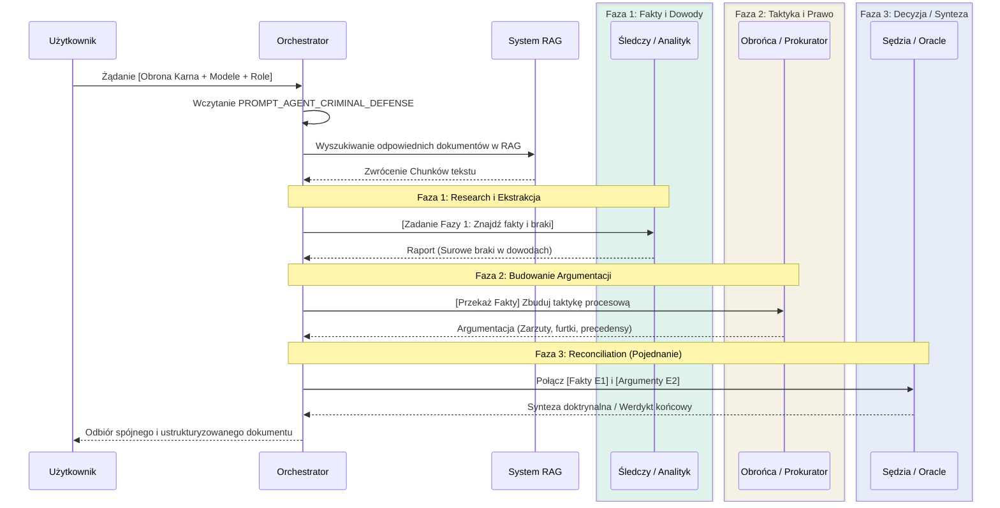

# Architektura Przepływu Informacji: Zadania AI i Role Ekspertów

Dokumentacja ta precyzuje, w jaki sposób zdefiniowane Zadania AI (Tasks) i Role Ekspertów (Roles) współpracują ze sobą na poziomie przepływu informacji (Data Flow) i orkiestracji (Orchestration). Celem jest zagwarantowanie, by system wieloagentowy (MoA) w projekcie `mój prawnik` generował najwyższej jakości treści bez wewnętrznych sprzeczności (tzw. prompt clash).

---

## 1. Wysokopoziomowy Przepływ Informacji

1.  **Warstwa Interfejsu (UI) - `QuickIntelligencePanel`**
    *   Użytkownik wybiera ogólne **Zadanie AI** (np. *Atak na dokument*).
    *   Zostaje odpalony filtr (Macierz Kompatybilności - `VALID_ROLES_FOR_TASK`), który wyklucza z listy wyboru te role, które kolidują z Zadaniem.
    *   Użytkownik przypisuje **Role Ekspertów** (np. *Inkwizytor*, *Analityk Dowodowy*) do swoich fizycznych Modeli LLM (np. Claude 3.5, GPT-4o).
    *   Logika **Graceful Degradation** dba o to, by zmiana Zadania AI czyściła stare, niekompatybilne przypisania.

2.  **Warstwa Połączenia (Backend Payload)**
    *   Frontend kompiluje Payload i wysyła do API listę aktywnych modeli i ich przypisanych ról.

3.  **Warstwa Orkiestratora (Backend - `OrchestratorService`)**
    *   System rozdziela **Globalny Prompt Zadania** (cel nadrzędny) i łączy go z **Promptami Ról** (specyficzny styl).
    *   System decyduje, jakie dane z Retrieval-Augmented Generation (RAG) podać którym agentom (tzw. `chunk_focus`).

4.  **Wieloagentowy Cykl Przetwarzania**
    *   Agentom przypisywane są zadania zgodnie z ich Fazami Przetwarzania (badania, strategia, synteza).

---

## 2. Diagram Przepływu Danych (Sequence Diagram)

Poniższy diagram kaskadowy ilustruje, jak odbywa się wielofazowa komunikacja w trakcie wykonywania Zadania (wyraźnie widać asynchroniczność i następstwo faz):



---

## 3. Typologia Ról Ekspertów i Ich Wpływ na Fazy Systemu

Role ekspertów (`expert_roles`) nie są jedynie zmianą tonu wypowiedzi. Determinują one, w jakiej formie agent otrzymuje kontekst z RAG (`chunk_focus`) i **na jakim etapie** działania systemu agent dostarcza najwięcej wartości.

### Faza 1: Research i Fakty (Początek Cyklu)
Eksperci z tej grupy powinni mieć jako pierwsi dostęp do surowego tekstu z RAG i zrzucać logi błędów lub istotne fragmenty. Opierają się na twardej logice i inżynierii wstecznej faktów.
*   **Role:** `investigator` (Śledczy), `evidencecracker` (Analityk Dowodowy), `proceduralist` (Specjalista Proceduralny), `forensic_expert` (Biegły).
*   **Cel:** "Extract" - Wydobywanie ukrytych powiązań i weryfikacja formalna.

### Faza 2: Strategia i Argumentacja (Środek Cyklu)
Bazują na faktach (bądź z RAG, bądź z analiz Fazy 1), aby wymodelować konkretny środek zaradczy.
*   **Role:** `defender` (Obrońca), `prosecutor` (Prokurator), `constitutionalist` (Konstytucjonalista), `inquisitor` (Inkwizytor).
*   **Faza 2, ID:** `sentencing_expert` (Ekspert ds. Wyroków)
    *   **Cel:** Modelowanie realistycznego wyroku na podstawie precedensów, stopnia winy i społecznej szkodliwości.
    *   **Chunk Focus:** Orzecznictwo wymiaru kary, recydywa, okoliczności łagodzące.

### Faza 3: Wykonanie i Synteza (Koniec Cyklu)
To role "wygładzające" (Reconciliation), decydujące o ostatecznym kształcie wyjścia. Wyłapują sprzeczności między Fazami 1 i 2, redagują ostateczne akty, orzekają co jest najlepsze.
*   **Role:** `hard_judge` (Sędzia), `navigator` (Nawigator), `grandmaster` (Strateg/Arcymistrz), `negotiator` (Mediator), `draftsman` (Redaktor).
*   **Faza 3, ID:** `oracle` (Wyrocznia Prawna)
    *   **Cel:** Synteza doktrynalna — nie argumentuje, ocenia całość z pozycji autorytetu. Działa jako meta-analityk prawa w oparciu o uchwały SN.

---

## 4. Macierz Kompatybilności (Task ↔ Role Mapping)

Wdrożono ograniczenia w interfejsie (`VALID_ROLES_FOR_TASK`), aby uniknąć absurdalnych poleceń. 

### A. Praca na dokumentach
*   **Analiza dokumentów (`analysis`)** 
    *   *Role:* `proceduralist`, `evidencecracker`, `forensic_expert`, `hard_judge`, `oracle`, `investigator`
*   **Redagowanie pism (`drafting`)**
    *   *required:* `[draftsman, proceduralist]`
    *   *optional:* `[evidencecracker, defender, prosecutor, oracle]` (Użycie EvidenceCrackera dostarcza "faktów", by pismo nie opierało się na samych spekulacjach)
*   **Atak na dokument (`document_attack`)**
    *   *Role:* `inquisitor`, `evidencecracker`, `proceduralist`, `hard_judge`

### B. Strategia i Planowanie
*   **Plan strategiczny (`strategy`)**
    *   *Role:* `grandmaster`, `navigator`, `hard_judge`, `negotiator`, `oracle`
*   **Diagnoza ogólna (`general`)**
    *   *Role:* `oracle`, `navigator`, `hard_judge`, `grandmaster`
*   **Badania i orzecznictwo (`research`)**
    *   *Role:* `oracle`, `constitutionalist`, `investigator`, `sentencing_expert`

### C. Postępowanie Karne i Spory
*   **Obrona karna (`criminal_defense`)**
    *   *Role:* `defender`, `proceduralist`, `evidencecracker`, `constitutionalist`, `sentencing_expert`
*   **Budowanie zarzutów (`charge_building`)**
    *   *Role:* `prosecutor`, `investigator`, `evidencecracker`, `forensic_expert`
*   **Rewizja aktu oskarżenia (`indictment_review`)**
    *   *Role:* `defender`, `inquisitor`, `proceduralist`, `evidencecracker`
*   **Argumentacja ds. kary (`sentencing_argument`)**
    *   *Role:* `sentencing_expert`, `defender`, `prosecutor`, `negotiator`

### D. Interwencje i Prawa Obywatelskie
*   **Tryb ratunkowy (`emergency_relief`)**
    *   *Role:* `navigator`, `proceduralist`, `defender`, `negotiator`
*   **Ochrona praw (`rights_defense`)**
    *   *Role:* `constitutionalist`, `defender`, `oracle`, `negotiator`
*   **Wniosek o areszt (`warrant_application`)**
    *   *Role:* `prosecutor`, `defender`, `proceduralist`, `hard_judge`
    *   *reconcile_mode:* `"adjudicate"` (W tym zadaniu exceptionally spotykają się Prokurator z Obrońcą. System nakłada na Faze 3 twardą flagę `adjudicate` – to nie jest miejsce na nieskończoną debatę, lecz na stanowczą ocenę zasadności wniosku).

---

## 5. Podsumowanie
Harmonia systemu opiera się na tym, że każdy agent wykonuje pracę, do której został logicznie predestynowany. System wieloagentowy działa tym skuteczniej, im ostrzejsze (bardziej zindywidualizowane) są granice pomiędzy rolami – łączenie wszystkich perspektyw powinno następować dopiero w Fazie Syntezy.

---

## 6. Kompozycja Zespołu (Team Compose): Minimum Team & Blocked Roles

Dla każdego z zadań zdefiniowana jest twarda reguła doboru optymalnych modeli minimalizująca szum w modelu:

```json
{
  "analysis": {
    "minimum_team": ["evidencecracker", "proceduralist", "hard_judge"],
    "optional": ["forensic_expert", "investigator", "oracle"],
    "blocked": ["inquisitor", "negotiator", "prosecutor", "defender", "draftsman"]
  },

  "drafting": {
    "minimum_team": ["draftsman", "proceduralist", "hard_judge"],
    "optional": ["evidencecracker", "defender", "prosecutor", "oracle"],
    "blocked": ["inquisitor", "investigator", "forensic_expert", "negotiator"]
  },

  "document_attack": {
    "minimum_team": ["inquisitor", "evidencecracker", "hard_judge"],
    "optional": ["proceduralist", "forensic_expert"],
    "blocked": ["defender", "negotiator", "oracle", "draftsman"]
  },

  "strategy": {
    "minimum_team": ["grandmaster", "navigator", "hard_judge"],
    "optional": ["negotiator", "oracle", "constitutionalist", "defender"],
    "blocked": ["inquisitor", "prosecutor", "forensic_expert", "evidencecracker", "draftsman"]
  },

  "general": {
    "minimum_team": ["oracle", "navigator", "hard_judge"],
    "optional": ["grandmaster", "proceduralist"],
    "blocked": ["inquisitor", "prosecutor", "defender", "forensic_expert", "draftsman"]
  },

  "research": {
    "minimum_team": ["constitutionalist", "investigator", "oracle"],
    "optional": ["sentencing_expert", "proceduralist"],
    "blocked": ["inquisitor", "negotiator", "draftsman", "forensic_expert"]
  },

  "criminal_defense": {
    "minimum_team": ["evidencecracker", "defender", "hard_judge"],
    "optional": ["constitutionalist", "proceduralist", "sentencing_expert"],
    "blocked": ["prosecutor", "inquisitor", "negotiator", "draftsman", "oracle"]
  },

  "charge_building": {
    "minimum_team": ["investigator", "prosecutor", "hard_judge"],
    "optional": ["evidencecracker", "forensic_expert"],
    "blocked": ["defender", "negotiator", "constitutionalist", "draftsman"]
  },

  "indictment_review": {
    "minimum_team": ["inquisitor", "proceduralist", "hard_judge"],
    "optional": ["defender", "evidencecracker"],
    "blocked": ["prosecutor", "negotiator", "oracle", "draftsman", "sentencing_expert"]
  },

  "sentencing_argument": {
    "minimum_team": ["sentencing_expert", "defender", "hard_judge"],
    "optional": ["prosecutor", "negotiator"],
    "blocked": ["inquisitor", "investigator", "forensic_expert", "oracle", "draftsman"]
  },

  "emergency_relief": {
    "minimum_team": ["navigator", "proceduralist", "defender"],
    "optional": ["negotiator", "hard_judge"],
    "blocked": ["inquisitor", "prosecutor", "grandmaster", "oracle", "draftsman"]
  },

  "rights_defense": {
    "minimum_team": ["constitutionalist", "defender", "hard_judge"],
    "optional": ["oracle", "negotiator"],
    "blocked": ["inquisitor", "prosecutor", "forensic_expert", "investigator", "draftsman"]
  },

  "warrant_application": {
    "minimum_team": ["prosecutor", "proceduralist", "hard_judge"],
    "optional": ["defender", "forensic_expert"],
    "blocked": ["negotiator", "inquisitor", "grandmaster", "oracle", "draftsman"],
    "reconcile_mode": "adjudicate"
  }
}
```

### Zasady Orkiestratora wynikające z JSON:
1. **Walidacja Przed Startem**: Jeśli użytkownik nie dobierze agentów wymaganych w `minimum_team`, interfejs blokuje przycisk wysłania zapytania i wyświetla alert, jakich kompetencji (ról) brakuje.
2. **Hard Blocked**: Role zdefiniowane jako `blocked` (oraz wszystkie pozostałe nieuwzględnione w minimum/optional) są całkowicie wyszarzone w selektorze podczas konfigurowania tego zadania. Nie da się ich przypisać.
3. **Rekomendacje**: Role `optional` są swobodnie dostępne. Interfejs może je podświetlać jako "Rekomendowane uzupełnienie zespołu", dając użytkownikowi swobodę w budowaniu narracji.
4. **Tryb Adjudykacji**: Specyficzna flaga `reconcile_mode: "adjudicate"` (obecna np. w `warrant_application`) instruuje Orchestrator, że podczas Fazy 3 (Reconcile) Sędzia (lub Nawigator) musi wejść w tryb bezwzględnego arbitra i ocenić zasadność, ignorując typowe zachęty do dalszej debaty.
